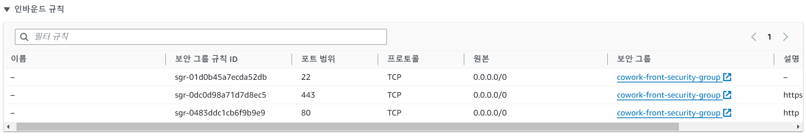
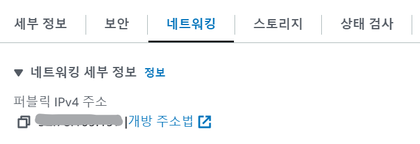
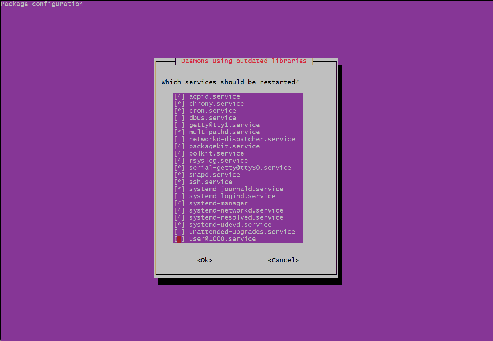
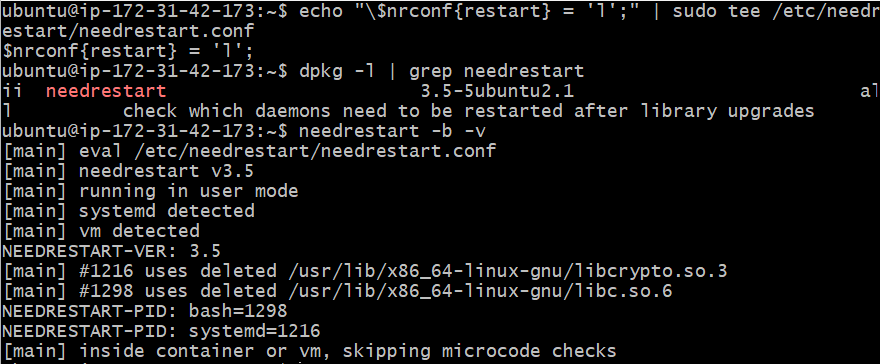
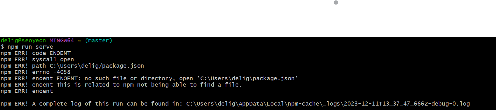

## 1. EC2 Instance 생성

## 2. 보안그룹 편집

- 기존 `ssh` 외의 `http`, `https` 추가


## 3. SSH를 이용한 EC2 Instance 접속

- window 기본 cmd가 아닌 `GitBash`로 접속
- 키페어(.pem)을 C:/Cloud로 복사
- 아래 명령어로 접속 > yes/no 선택 시 yes 선택
```
ssh -i C:/Cloud/cowork-front.pem ubuntu@[퍼블릭 IPv4 주소]   #[퍼블릭 IPv4 주소]는 xx.xx.xxx.xxx의 10자리 수
```



## 4. 프론트엔드

1. npm 환경 구축

- 우분투에 `curl` 설치
`sudo apt-get install -y curl`

- node.js와 npm 설치
```
sudo apt update
sudo apt install nodejs
sudo apt install npm
npm install vue    #본 프로젝트에서 vue 사용하기에 설치
#위 명령어만 했는데 버전 확인 안 되는 경우
sudo apt-get update
sudo apt-get install -y build-essential
sudo apt-get install curl
curl -sL https://deb.nodesource.com/setup_16.x | sudo -E bash --
sudo apt-get install -y nodejs
```

- 설치 확인
```
node -v
npm -v
npm vue -v
```


2. git clone으로 github에서 배포할 파일 가져오기

3. 서버 배포

- git clone으로 받은 파일은 git에 올라온 이름으로 폴더 생성 
    - 해당 폴더로 들어가서 실행해야함
    - 본 폴더명은 `front`
```
cd front
npm i   #npm install의 약자
npm run serve
```

### 오류 Collection

1. Daemons using outdated libraries


**해결**
```
#needrestart.conf 구성 파일 확인
vim /etc/needrestart/needrestart.conf 

#설정 변경
echo "\$nrconf{restart} = 'l';" | sudo tee /etc/needrestart/needrestart.conf    

#패키지 검색 후 needrestart 키워트 필터링해 목록 확인
dpkg -l | grep needrestart  

#-b: needrestart를 실행할 때, 재시작이 필요한 프로세스를 실제로 재시작하지 않도록 하는 옵션, -v: 상세한 출력 보여주는 옵션
needrestart -b -v   
```



2. @vitejs/plugin-vue requires vue (>=3.2.13) or @vue/compiler-sfc to be present in the dependency tree.

**해결**
```
npm install vue@3.2.13 --save-dev
npm install @vue/complier-sfc --save-dev
```

3. A complete log of this run can be found in


**해결**
- ec2에 접속했는지 확인 후 접속되지 않았으면 접속
- 캐시 삭제 후 재설치
```
npm cache clean --force 
npm install --cache
```


## 개념

`SSH`는 네트워크 상 다른 컴퓨터의 쉘을 사용할 수 있게 해 주는 프로그램 혹은 그 프로토콜

`pem` 형식의 파일은 우리가 생성한 서버에 원격으로 접속할 때, 외부의 보안 위협으로부터 보호해주는 ‘SSH’라는 보안 방식이 적용된 서버에서 반드시 필요한 파일