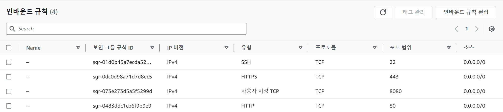

# 1. EC2에 Front 배포
## 1. EC2 Instance 생성

- Instance Name: `cowork-front`
- OS Image: `Ubuntu`
- Storage: `30GiB`
- pem 키 경로 `C:\Cloud\cowork-front.pem`

## 2. 보안그룹 편집

- 기존 `ssh` 외의 `http`, `https` 추가
- 서비스 사용시 사용할 `8080 port`도 추가



## 3. SSH를 이용한 EC2 Instance 접속

- window 기본 cmd가 아닌 `GitBash`로 접속
- 키페어(.pem)을 C:/Cloud로 복사
- 아래 명령어로 접속 > yes/no 선택 시 yes 선택
```
ssh -i C:/Cloud/cowork-front.pem ubuntu@[퍼블릭 IPv4 주소]   #[퍼블릭 IPv4 주소]는 xx.xx.xxx.xxx의 10자리 수
```


## 4. 프론트엔드

### 1. npm 환경 구축

- node.js와 npm 설치 -NVM 사용

```
#NVM 설치
curl -o- https://raw.githubusercontent.com/nvm-sh/nvm/v0.35.3/install.sh | bash
nvm --version   #nvm 버전확인 

##node&npm 설치
nvm install 14.4.0
```

- **nvm not found 오류 해결**
    - 1. `touch ~/.zshrc`로 파일 생성
    - 2. `vi ~/.zshrc`로 들어가서 아래 코드 입력 후 `:wq`로 저장 종료
    ```
    export NVM_DIR="$HOME/.nvm"
    [ -s "$NVM_DIR/nvm.sh" ] && \. "$NVM_DIR/nvm.sh" # This loads nvm
    ```
    - 3. `source ~/.zshrc` 로 스크립트 실행

- 설치 확인
```
node -v
npm -v
npm vue -v
```


### 2. git clone으로 github에서 배포할 파일 가져오기

### 3. 서버 배포

- 코드에서 axios 오류난 곳 코드 삭제

- .env 파일 확인
    - `ls -a`로 확인 가능
    - `gateway URI 정확히 입력`했는지 확인
        - gateway URI: `[KPAAS harbor IP]:[apigateway NodePort]`


- git clone으로 받은 파일은 git에 올라온 이름으로 폴더 생성 
    - 해당 폴더로 들어가서 실행해야함
    - 본 폴더명은 `front`
```
cd front
npm i   #npm install의 약자. package.json 에 포함된 의존성 패키지 일괄 설치
npm run serve
```

- `[퍼블릭 IPv4 주소]:8080`


# 2. Route53 도메인 인증

> (1)가비아에서 도메인을 구매하고, (2)AWS(Route 53)에서 도메인 소유를 인증하고,(3+4)ACM(AWS Certification Manager)를 통해 SSL(TSL) 인증서를 발급
> (5)EC2 인스턴스의 로드 밸런싱을 위한 타겟 그룹을 생성하고,(6)로드 밸런서(Load Balancer)로 리다이렉트 규칙을 설정하고(http 요청을 https로 리다이렉트),(7)로드 밸런서의 Health check를 통과해 로드 밸런싱을 안전하게 유지 

## 1. 가비아에서 도메인 구매

`testdomain2.store`

## 2. AWS Route53에서 도메인 소유 인증

1. `AWS Route53`의 호스팅 영역 > 호스팅 영역 생성
- 도메인 이름을 가비아에서 구매한 도메인으로 작성
- 나머지는 default로 유지

2. `가비아`의 도메인 네임서버 변경

- 가비아 홈페이지에서 My가비아 > 이용중인 서비스 > 도메인> (내가 구입한 도메인)관리 클릭

- 네임서버 옆의 "설정" 클릭
    - 1~4차 호스트명에 AWS Route53 레코드의 NS 레코드의 라우팅 대상 4개 삽입
        - 이때 마지막 "."은 제거하고 삽입
    - 소유자 인증 후 적용

## 3. ACM을 통해 SSL 인증서 발급

- `SSL`(TSL) 인증서 발급
    - 도메인에 대한 보안 인증서
1. AWS에 `Certificate Manager` 검색해 대시보드로 이동
- 인증서 요청 > 퍼블릭 인증서 요청  
    - 도메인 이름에 구매한 도메인 입력
    - DNS 검증 (기본)
    - RSA 2048 (기본) 설정 후 요청
2. ACM 메뉴(왼쪽)에서 "인증서 나열" 클릭 시 요청한 인증서 확인 가능
- DNS 검증 상태가 `검증 대기중`, `아니요`, `부적격`이 정상

## 4. CNAME 레코드 생성
1. 방금 발급받은 인증서 ID 클릭 > "도메인에서 Route53에서 레코드 생성" 클릭
- 도메인 체크
2. 일정 시간 지난 후 인증서 상태가 `발급됨`으로 변경
- 짧게 20~30분 소요되지만 길게 2시간까지도 소요

## 5. EC2 인스턴스의 로드 밸런싱을 위한 타겟 그룹을 생성

1. 개념

- Load Balancer는 요청을 여러 서버로 분산시키기 위해 사용하는 기술로, target group을 여러 개 생성하고 들어오는 요청을 특정 알고리즘에 따라 각 target group에 분산시켜 전송

- 구현하고자 하는 것
    - target group 1개
    - HTTPS 요청 -> HTTPS를 거친 후 Load Balancing을 통해 본래 사용하던 HTTP port(target group)로 요청
    - HTTP 요청 -> 위의 HTTPS로 redirection 
        - 이때 HTTP와 HTTPS는 리스너에서 캐치하고 HTTP로의 요청을 redirection할 때 리스너 규칙 사용

2. 준비사항

- 네트워크는 연결할 EC2의 설정을 따를 것. ex. VPC
- 보안그룹은 연결할 EC2의 설정을 따를 것
- 본인의 웹 서버에서 사용하는 port 번호 사용할 것 => 8080

### 1. 보안그룹 수정

1. EC2에서 사용하는 보안그룹 수정

2. EC2 > 보안 > 보안그룹 선택

- "인바운드 규칙 편집" 선택
- (웹 서버에서 사용 중인 port 번호인) `8080`, `443`번 port에 대해 Anywhere-IPv4, Anywhere-IPv6 등록
    - Anywhere-IPv4, Anywhere-IPv6은 `0.0.0.0/0`과 `::/0` 의미
    - HTTP, HTTPS의 모든 요청을 열겠다는 의미


    
### 2. Target Group 생성

1. EC2 메뉴 하단에 "대상 그룹" 클릭 > `Target Group` 생성

- target type은 Instance
- target group name에는 적당한 이름 설정. `[이름]-lb-tg`로 하면 loadbalancer를 위한 target group임을 알 수 있음
- Protocol은 HTTP 그대로 두고 Port는 8080
- VPC는 EC2와 동일하게 설정. EC2에서 default VPC로 설정되어있으면 default 그대로

2. target group 등록

- 사용할 instance 체크 후 port 번호 확인하고 "Include as pending below" 클릭


3. target group이 존재하면 "target group 생성" 선택

## 6. 로드 밸런서(Load Balancer)로 리다이렉트 규칙을 설정하고(http 요청을 https로 리다이렉트)

### 1. Load Balancer 생성

1. "Load Balancer" 클릭 > "Create load balancer"

- Application Load Balancer (ALB)로 생성
- Load balancer name은 "[load balancer name]-lb"
- Network mapping에서 VPC는 `EC2가 사용하는 VPC`, Mapping은 `EC2의 Subnet`과 매핑
    - EC2 대시보드에서 VPC ID를 통해 VPC 확인 가능하고, 서브넷을 통해 Subnet 확인 가능
    - 이름 작성 시의 페이지에서 Scheme을 Internet-facing(인터넷 경계)으로 설정했기에 반드시 `Public Subnet`으로 매핑해야함
- 보안 그룹은 EC2의 인스턴스와 동일하게 설정
- Listener을 HTTP:8080, HTTPS:443으로 설정하고 Forward to에서 직전에 생성한 target group 설정
- Secure listener settings에서 Default SSL/TLS certificate를 From ACM으로 이전에 생성한 인증서 적용
- "Create load balancer" 선택


### 2. 도메인 레코드 생성

1. Route53을 통해 생성한 호스팅 영역에는 레코드 4개가 존재해야함 
    - `A`, `NS`, `SOA`, `CNAME`
    - 현재 단계에서는 A 레코드 생성

2. Route53 > 호스팅 영역 대시보드에서 "레코드 생성" 클릭
- 레코드 이름은 사용해도되고 안해도되지만 넘어가는 것으로 
- 별칭 체크
- 트래픽 라우팅 대상
    - Application/Classic Load Balancer에 대한 별칭
    - 아시아 태평양(서울) [ap-northeast-2]
    - 이전에 생성한 `Load balancer` 지정

### 3. Load Balancer Listener 규칙 추가

1. Load balancer > Listener 
- HTTPS:443과 HTTP:8080 확인 가능
- HTTP:443에는 Default SSL cert 연결 가능

2. HTTPS:443 Rules 편집
- HTTPS:443 클릭 > Rules > "Manage rules"
- IF `요청 시에만 라우팅`, THEN `1. 전달 대상을 target group`으로 설정 후 저장
    - 요청 시 target group으로 100% 보내는 것 의미

3. HTTP:8080 Rules 편집
- HTTP:8080 클릭 > Rules > "Manage rules"
- IF `호스트 헤더에 Route53도메인 이름(.com, .shop)` 넣고, THEN `1. 리디렉션 대상에 HTTPS 443` 설정 후 저장

4. Load Balancer의 Listener 확인하면 Rules가 1,2 존재

## 7. 로드 밸런서의 Health check를 통과해 로드 밸런싱을 안전하게 유지 

### 1. Health check

1. EC2 좌측 메뉴의 Load balancing > 대상 그룹에서 "생성한 대상 그룹" 선택

- 대상의 health status 확인 가능
- health check 시 EC2 인스턴스 위에서 웹 서버가 구동되고 있어야 함

2. ...

#### 참고
<https://woojin.tistory.com/93#google_vignette>
<https://woojin.tistory.com/94>

### 오류 Collection

## 1. EC2에 Front 배포

**1. Daemons using outdated libraries**


**해결**
```
#needrestart.conf 구성 파일 확인
vim /etc/needrestart/needrestart.conf 

#설정 변경
echo "\$nrconf{restart} = 'l';" | sudo tee /etc/needrestart/needrestart.conf    

#패키지 검색 후 needrestart 키워트 필터링해 목록 확인
dpkg -l | grep needrestart  

#-b: needrestart를 실행할 때, 재시작이 필요한 프로세스를 실제로 재시작하지 않도록 하는 옵션, -v: 상세한 출력 보여주는 옵션
needrestart -b -v   
```


**2. @vitejs/plugin-vue requires vue (>=3.2.13) or @vue/compiler-sfc to be present in the dependency tree.**

**해결**
- `프로젝트 내`에서 아래 코드 실행
```
npm install vue@3.2.13 --save-dev
npm i @vue/compiler-sfc #@vue/compiler-sfc : 브라우저에서 vue파일이 작동하도록 변환
#npm install @vue/complier-sfc --save-dev
```

**3. A complete log of this run can be found in**


**해결**
- ec2에 접속했는지 확인 후 접속되지 않았으면 접속
- 캐시 삭제 후 재설치
```
npm cache clean --force 
npm install --cache
```

**4. npm ERR! path /home/ubuntu/front-test/front/node_modules/node-sass npm ERR! command failed**


**해결**

- node-sass를 최신 버전으로 재설치
```
npm add node-sass
```

**5. 무한로딩**

**해결**

- npm version 7이상에 문제가 있는듯해서 npm version6으로 재설치
- npm 삭제 시 nodejs도 함께 삭제 후 재설치

```
sudo apt-get remove nodejs
sudo apt-get remove npm

#cd /etc/apt/sources.list.d로 이동하여 노드 목록 제거

sudo rm -rf /usr/local/bin/npm /usr/local/share/man/man1/node* /usr/local/lib/dtrace/node.d ~/.npm ~/.node-gyp /opt/local/bin/node /opt/local/include/node /opt/local/lib/node_modules

sudo rm -rf /usr/local/lib/node*

sudo rm -rf /usr/local/include/node*

sudo rm -rf /usr/local/bin/node*
```

- 확인
```
node -v
npm -v
```


### 개념

`SSH`는 네트워크 상 다른 컴퓨터의 쉘을 사용할 수 있게 해 주는 프로그램 혹은 그 프로토콜

`pem` 형식의 파일은 우리가 생성한 서버에 원격으로 접속할 때, 외부의 보안 위협으로부터 보호해주는 ‘SSH’라는 보안 방식이 적용된 서버에서 반드시 필요한 파일

## 2. 