# PaaS-TA에 MSA 배포

## 1. Architecture 및 배포 순서 설명

1. Architecture 구성도


2. Port 번호


## 2. DB 환경 구축

1. YAML 파일 생성

`mysql-msa-[board, comment, user].yaml`

```
apiVersion: apps/v1
kind: Deployment
metadata:
    name: mysql-msa-board
spec:
    selector:
        matchLabels:
            app: mysql-board
    strategy:   #pod 교체 전략. Recreate는 기존 pod 모두 삭제 후 다음 새로운 pod 생성
        type: Recreate
    template:
        metadata:
            labels:
                app: mysql-board
        spec:
            containers:
                - image: mysql:5.6
                  name: mysql-board
                  env:
                    - name: MYSQL_ROOT_PASSWORD
                      value: password
                  ports:
                    - containerPort: 3306
                      name: mysql-board
            volumes:
                - name: mysql-board
---
apiVersion: v1
kind: Service
metadata:
    name: mysql-msa-board
spec:
    type: NodePort
    ports:
      - port: 3306
        protocol: TCP
        targetPort: 3306
        nodePort: ${MYSQL_MSA_BOARD}    #외부 포트. ${MYSQL_MSA_BOARD}: 305xx
    selector:
        app: mysql-board
```

2. DB 배포

- DB 배포: `kubectl apply -f ${MYSQL_YAML_NAME}.yaml`

- DB 조회 : `kubectl get pods`

3. container 실행

- pod 내 container 실행 : `kubectl exec -it [POD NAME] /bin/bash`

- `터미널에서 DB 접속`

  - `mysql -u root -p` 후 비밀번호 입력란에 `password` 입력

    - 비밀번호는 YAML 파일에서 지정
    - 비밀번호가 맞으면 DB 접속

  - `데이터베이스 생성` : `CREATE DATABASE msa_board default CHARACTER SET UTF8;`

    - `CREATE DATABASE [DATABASE NAME] default CHARACTER SET UTF8;`

  - DB 종료: `exit`

5. 데이터베이스 연결

- datagrip 이용

- 새 데이터베이스 열기
- MySQL DB 선택
- Server Host에는 ${KUBERNETES_URL}, Database에는 ${DATABASE_NAME} Port에 NodePort, Username에 root, Password에 password 입력
  - ${KUBERNETES_URL} : 쿠버네티스 URL
  - ${MYSQL_MSA_BOARD} : `kubectl get services`의 PORT(S)의 " : " 뒤의 숫자가 NodePort
  - ${Username} : root. yaml 파일
  - ${Password} : password. yaml 파일
- Test Connection
- (Drive 설치 창 출력 시) Download 버튼 클릭해 Driver 설치

6. SQL 스크립트 불러오기 & 실행

- SQL 아이콘 클릭 > 파일 > SQL 스크립트 불러오기

- 스크립트를 불러온 후 스크립트를 실행할 DB 선택 후 오른쪽 마우스 클릭 > 실행 > SQL 스크립트 실행

## 3. 소스 코드 환경 설정 및 war 파일 생성

- msa 서비스의 `properties 파일` 수정

- properties 경로는 src/main/resources/properties/[FILE NAME]

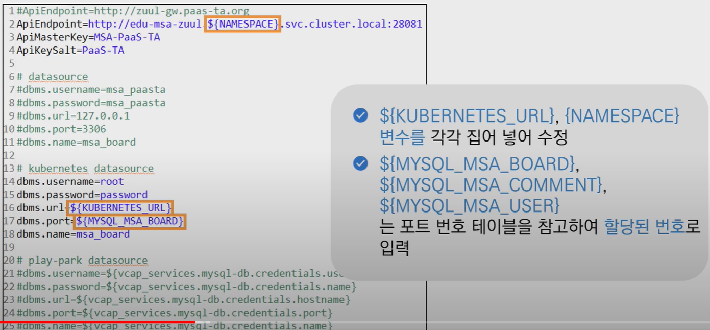

- 내 서비스의 경우 config 파일로 나뉘어 git에 별도로 올라가있기에 해당 단계 할 필요없이 git의 코드 수정하면 됨

## 4. Docker Image

### 1. Image 저장소 생성

- 플레이파크 포탈에서 `Container Platform Pipeline` 선택 > 서비스 이름 입력 후 생성
  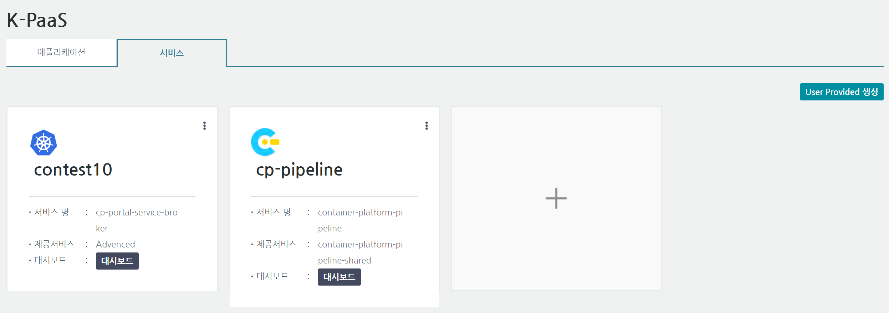
- 플레이파크 포탈에서 (위에서 생성한 pipeline 말고) 기존에 존재한 서비스의 대시보드 클릭

- 아래 페이지의 Private Repository 접속

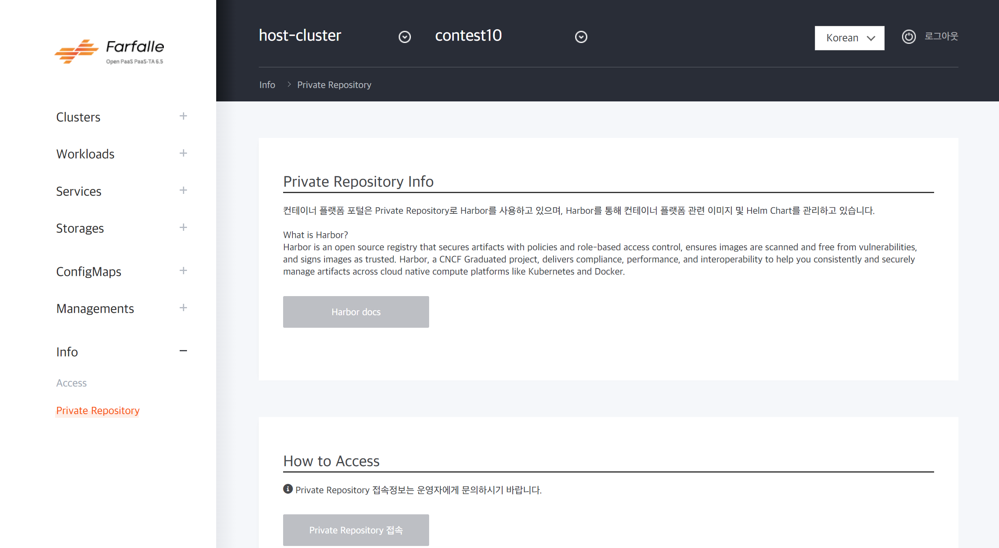

    - `Harbor` 계정 자동 생성
        - Username = 플레이파크 계정 id
        - password = [USERNAME]-Harbor1

- 접속 완료
  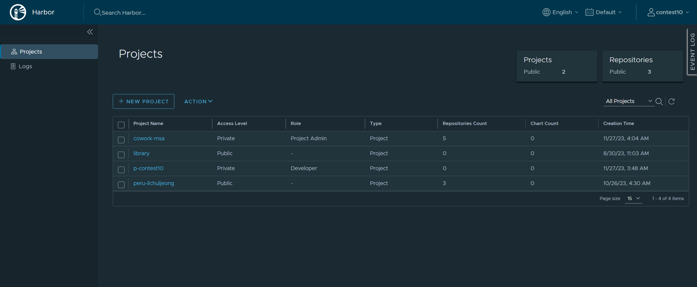

- Harbor Projects 생성
  - NEW PROJECT 클릭 > 프로젝트 이름 입력
  - 생성된 프로젝트명은 ${DIRECTORY_NAME}으로 사용

### 2. Insecure-registries 설정

- Harbor(이미지 저장소)의 URL 확인

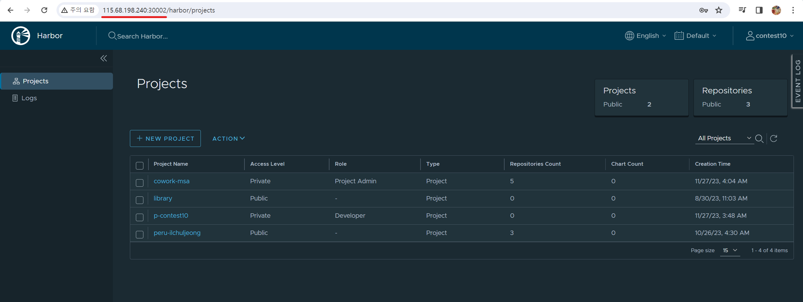

- Docker Desktop의 Settings > Docker Engine 선택
  - 아래 코드 입력 후 Apply&Restart
  - ${IMAGE_REGISTRY_URL:PORT}는 직전에 확인한 URL과 port 사용

```
"insecure-registries": [
    "${IMAGE_REGISTRY_URL:PORT}"
]
```

### 3. 이미지 저장소 로그인

`docker login ${IMAGE_REGISTRY_URL}:30002 --username [이미지 저장소 ID] --password [이미지 저장소 password]`

### 4. Dockerfile 작성

1. 서비스의 Dockerfile `board`, `comment`, `ui`, `user`

```
FROM tomcat:9-jre8-alpine
WORKDIR /usr/local/tomcat
COPY server.xml ./conf
RUN rm -rf ./webapps/*
ARG JAR_FILE=*.war
COPY ${JAR_FILE} ./webapps/edu-msa-board-1.0.0.war

EXPOSE 28082
```

2. `zuul`

```
FROM openjdk:8-jdk-alpine
ARG JAR_FILE=edu-msa-zuul-1.0.0.war
COPY ${JAR_FILE} edu-msa-zuul-1.0.0.war
COPY application.yml /application.yml
ENTRYPOINT ["java","-jar","-Dspring.config.location=application.yml","/edu-msa-zuul-1.0.0.war"] #ENTRYPOINT란 컨테이너 실행시 수행되는 명령어 지정
```

### 5. Docker Image 생성을 위한 파일 구성

1. 서비스의 Dockerfile `board`, `comment`, `ui`, `user`

- `Dockerfile`을 작성한 경로에 앞에서 생성한 `war 파일`과 다운받은 `server.xml` 넣기

2. `zuul`

- `Dockerfile`을 작성한 경로에 앞에서 생성한 `war 파일`과 다운받은 `application.yml` 넣기

### 6. Docker Image 생성 및 배포

1. docker image 빌드 `docker build --tag [생성할 이미지 이름]:[태그] [현재 위치]`

- `docker build --tag edu-msa-board:latest .`

2. docker image 태그 `docker tag [기존 이미지 이름] [이미지 저장소 URL:이미지 저장소 포트/경로 지정/새로운 이미지 이름]`

- `docker tag edu-msa-board 45.248.73.57:5001/edu-msa-01/edu-msa-board`

3. docker image 업로드 `docker push [이미지 저장소에 업로드할 이미지 이름]`

- `docker push 45.248.73.57:5001/edu-msa-01/edu-msa-board`
  - docker image가 이미지 저장소인 Harbor에 들어감

## 5. Kubernetes 배포

### 1. Secret 생성

- 이미지에 대한 도커 레지스트리 접속 자격 증명 저장을 위한 시크릿 생성
- `kubectl create secret docker-registry [SECRET NAME] --docker-server=[이미지 저장소 URL:이미지 저장소 port] --docker-username=[이미지 저장소 ID] --docker-password=[이미지 저장소 비밀번호]`
  - `kubectl create secret docker-registry edu-msa-secret --docker-server=45.248.73.47:5001 --docker-username=admin --docker-password=admin`
  - docker-username과 docker-password는 Harbor 접근시 사용한 username과 password 사용
  - secret명을 edu-msa-secret으로 설정

### 2. API YAML 파일

1. `redis-msa-ui.yaml`

- 가장 먼저 사용. DB 생성 전에 가장 먼저 생성

```
apiVersion: v1
kind: ConfigMap
metadata:
    name: redis-msa-config
data:
    redis-config: "requirepass password"    #저장할 [key]:[value]
---
apiVersion: apps/v1
kind: Deployment
metadata:
    name: redis-msa-ui
    labels:
        app: redis
spec:
    replicas: 1
    selector:
        matchLabels:
            app: redis
    template:
        metadata:
            labels:
                app: redis
        spec:
            containers:
                - name: redis
                  image: redis:latest
                  command:  #배포시 실행할 명령어
                    - redis-server
                    - "/redis-master/redis.conf"
                  env:      #환경 변수 설정
                    - name: MASTER
                      value: "true"
                  ports:
                    - containerPort: 6379
                  resources:    #리소스 제한 설정
                    limits:
                        cpu: "0.1"
                  volumeMounts: #컨테이너에 볼륨마운트할 위치 설정
                    - mountPath: /redis-master-data
                      name: data
                    - mountPath: /redis-master
                      name: config
            volumes:    #pod에 제공할 볼륨 지정
              - name: data
                emptyDir: {}    #emptyDir: pod 생성시 생성되는 임시 볼륨
              - name: config
                configMap:
                    name: redis-msa-config  #mount하려는 configMap의 이름 지정
                    items:  #configMap에서 파일로 생성할 key 배열
                        - key: redis-config
                          path: redis.conf
---
apiVersion: v1
kind: Service
metadata:
    name: redis-msa-ui
    labels:
        app: redis
spec:
    ports:
        - nodePort: ${REDIS_MSA_UI} #외부 port. 308xx
          port: 6379
          protocol: TCP
          targetPort: 6379
    selector:
        app: redis
    type: NodePort
```

2. `mysql-msa-[board, comment, user].yaml`

- DB 섹션에서 이미 사용

```
apiVersion: apps/v1
kind: Deployment
metadata:
    name: mysql-msa-board
spec:
    selector:
        matchLabels:
            app: mysql-board
    strategy:   #pod 교체 전략. Recreate는 기존 pod 모두 삭제 후 다음 새로운 pod 생성
        type: Recreate
    template:
        metadata:
            labels:
                app: mysql-board
        spec:
            containers:
                - image: mysql:5.6
                  name: mysql-board
                  env:
                    - name: MYSQL_ROOT_PASSWORD
                      value: password
                  ports:
                    - containerPort: 3306
                      name: mysql-board
            volumes:
                - name: mysql-board
---
apiVersion: v1
kind: Service
metadata:
    name: mysql-msa-board
spec:
    type: NodePort
    ports:
      - port: 3306
        protocol: TCP
        targetPort: 3306
        nodePort: ${MYSQL_MSA_BOARD}    #외부 포트. ${MYSQL_MSA_BOARD}: 305xx
    selector:
        app: mysql-board
```

3. `edu-msa-[board,comment,ui,user].yaml`

```
apiVersion: apps/v1
kind: Deployment
metadata:
    name: edu-msa-board
    labels:
        app: board-msa
spec:
    replicas: 1
    selector:
        matchLabels:
            app: board-msa
    template:
        metadata:
            labels:
                app: board-msa
        spec:
            containers:
              - name: board-msa
                image: [이미지 저장소 URL]:[이미지 저장소 port]/[경로]/[이미지명]:[태그]  #${IMAGE_REGISTRY_URL}:xxxx/${DIRECTORY_NAME}/${IMAGE_NAME}:latest
                imagePullPolicy: Always
                ports:
                  - containerPort: 28082
            imagePullSecrets:
              - name: edu-msa-secret
---
apiVersion: v1
kind: Service
metadata:
    name: edu-msa-board
    labels:
        app: board-msa
spec:
    ports:
        - nodePort: ${EDU_MSA_BOARD}    #이전에 서비스(board,comment,...)별로 할당한 외부 포트
          port: 28082
          protocol: TCP
          targetPort: 28082
    selector:
        app: board-msa
    type: NodePort
```

4. `edu-msa-zuul.yaml`

```
apiVersion: apps/v1
kind: Deployment
metadata:
    name: edu-msa-zuul
    labels:
        app: zuul-msa
spec:
    replicas: 1
    selector:
        matchLabels:
            app: zuul-msa
    template:
        metadata:
            labels:
                app: zuul-msa
        spec:
            containers:
              - name: zuul-msa
                images: ${IMAGE_REGISTRY_URL}:xxxxx/${DIRECTORY_NAME}/${IMAGE_NAME}:latest
                imagePullPolicy: Always
                ports:
                  - containerPort: 28081
              env:
              - name: BOARD_MSA_URL
                value: "edu-msa-board.${NAMESPACE}.svc.cluster.local:28082"
              - name: COMMENT_MSA_URL
                value: "edu-msa-comment.${NAMESPACE}.svc.cluster.local:28083"
              - name: USER_MSA_URL
                value: "edu-msa-user.${NAMESPACE}.svc.cluster.local:28084"
            imagePullSecrets:
              - name: edu-msa-secret
---
apiVersion: v1
kind: Service
metadata:
    name: edu-msa-zuul
    labels:
        app: zuul-msa
spec:
    ports:
      - nodePort: ${EDU_MSA_ZUUL}
        port: 28081
        protocol: TCP
        targetPort: 28081
    selector:
        app: zuul-msa
    type: NodePort
```

### 3. 배포

`kubectl apply -f [APPLICATION_YAML_NAME].yaml`
`kubectl get pods`

## 6. Application 배포 확인

1. Kubernetes URL 확인

- 플랫폼의 Access에서 `CP_SERVICE_CLUSTER_SERVER`의 port 앞까지

2. UI port 확인

- `kubectl get services`에서 edu-msa-ui의 port 확인 => NodePort확인. 명령어 실행 후 ":" 뒤 숫자

3. Application 포털 접속

- `http://[Kubernetes URL]:[외부 포트 번호]/user/login`
  - 직전에 Kubernetes URL과 외부 포트 번호 확인함

## 실습

- 플랫폼에서 Pipeline 생성 > Project 생성
- Harbor에서 URL과 port 확인
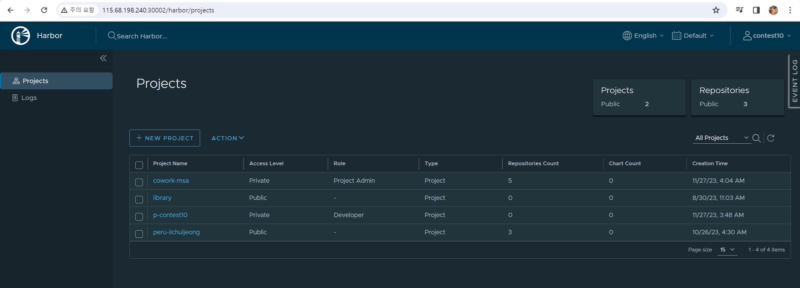
- Docker Desktop
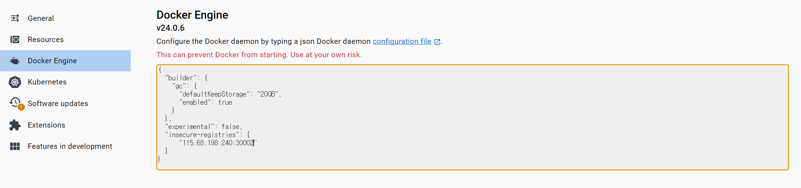
- docker login `docker login 115.68.198.240:30002 --username [HARBOR USERNAME] --password [HARBOR PASSWORD]`
    - Harbor username은 플랫폼 id와 동일하고 password는 username에 -Harbor1을 붙인 것
- 기존에 만들었던 image 사용해 docker tag + docker push
    - `docker tag [IMAGE ID] [HARBOR URL]:[HARBOR PORT]/[HARBOR PROJECT NAME]/[IMAGE NAME]` 
    - `docker push [HARBOR URL]:[HARBOR PORT]/[HARBOR PROJECT NAME]/[IMAGE NAME]`
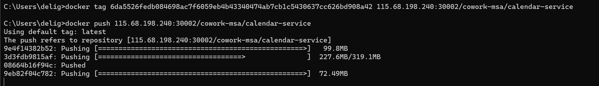

- secret 생성
    - `kubectl create secret docker-registry [SECRET NAME] --docker-server=[HARBOR URL]:[HARBOR PORT] --docker-username=[HARBOR USERNAME] --password=[HARBOR PASSWORD]`
    - secret 이름: cowork-msa-secret
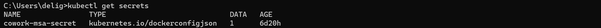

- yaml 파일 수정 후 `kubectl apply -f [YAML NAME].yaml`
    - `image` 수정
1. `dashboard.yaml`
```
apiVersion: apps/v1
kind: StatefulSet
metadata:
  name: dashboard-service
spec:
  replicas: 1
  selector:
    matchLabels:
      app: dashboard-service
  template:
    metadata:
      labels:
        app: dashboard-service
    spec:
      containers:
        - name: dashboard-service
          image: 115.68.198.240:30002/cowork-msa/dashboard-service:latest
          ports:
            - containerPort: 5004
          env:
            - name: spring.cloud.config.uri
              value: http://config-service:8888
            - name: spring.rabbitmq.host
              value: rabbitmq
            - name: eureka.client.service-url.defaultZone
              value: http://discovery-service:8761/eureka
---
apiVersion: v1
kind: Service
metadata:
  name: dashboard-service
spec:
  selector:
    app: dashboard-service
  ports:
    - protocol: TCP
      port: 5004
  clusterIP: None
```

2. `calendar.yaml`
```
apiVersion: apps/v1
kind: StatefulSet
metadata:
  name: calendar-service
spec:
  replicas: 1
  selector:
    matchLabels:
      app: calendar-service
  template:
    metadata:
      labels:
        app: calendar-service
    spec:
      containers:
        - name: calendar-service
          image: 115.68.198.240:30002/cowork-msa/calendar-service:latest
          ports:
            - containerPort: 81
          env:
            - name: spring.cloud.config.uri
              value: http://config-service:8888
            - name: spring.rabbitmq.host
              value: rabbitmq
            - name: eureka.client.service-url.defaultZone
              value: http://discovery-service:8761/eureka
---
apiVersion: v1
kind: Service
metadata:
  labels:
    app: calendar-service
  name: calendar-service
spec:
  selector:
    app: calendar-service
  ports:
    - protocol: TCP
      port: 5001
      targetPort: 81
```

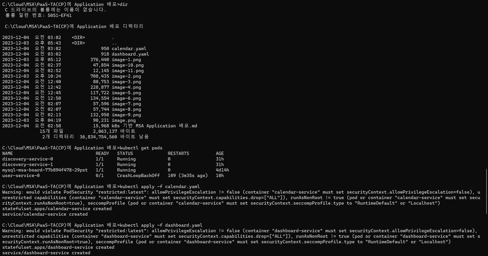

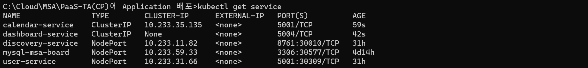

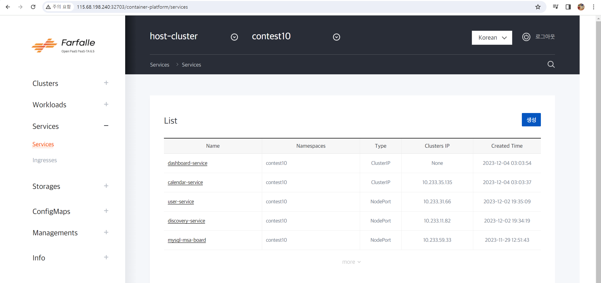

- 접속 확인
    - dashboard의 경우 브라우저에 `115.68.198.240:[frontend port 번호]`

## 참고영상

<https://www.youtube.com/watch?v=A1euGLsY4qE&list=PL-AoIAa-OgNncmEDFYsy0NAGvFu15zJb1&index=27>
