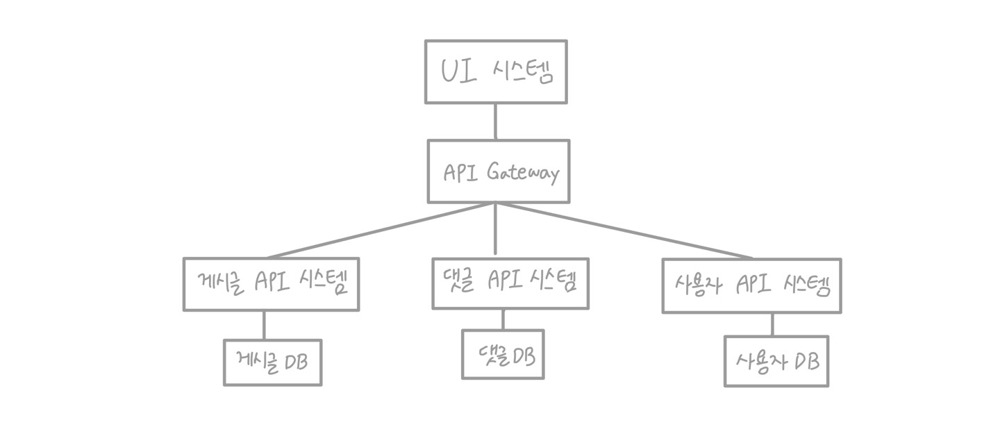
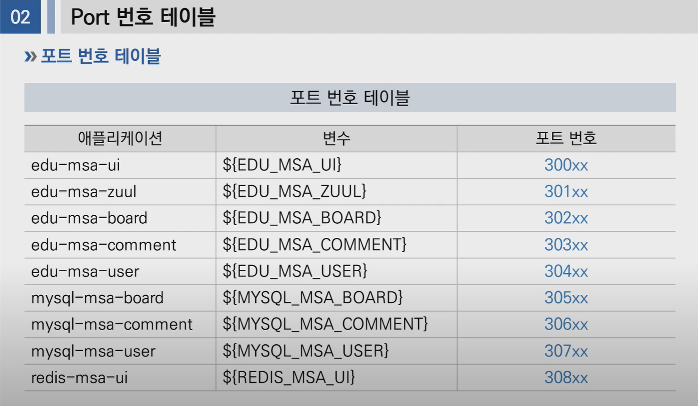

# PaaS-TA에 MSA 배포
## 1. Architecture 및 배포 순서 설명

1. Architecture 구성도



2. Port 번호



## 2. DB 환경 구축

## 3. Docker Image 

## 4. Kubernetes 배포

1. `redis-msa-ui.yaml`
```
apiVersion: v1
kind: ConfigMap
metadata:
    name: redis-msa-config
data:
    redis-config: "requirepass password"    #저장할 [key]:[value]
---
apiVersion: apps/v1
kind: Deployment
metadata:
    name: redis-msa-ui
    labels:
        app: redis
spec:
    replicas: 1
    selector:
        matchLabels:
            app: redis
    template:
        metadata:
            labels:
                app: redis
        spec:
            containers:
                - name: redis
                  image: redis:latest
                  command:  #배포시 실행할 명령어
                    - redis-server
                    - "/redis-master/redis.conf"
                  env:      #환경 변수 설정
                    - name: MASTER
                      value: "true"
                  ports:
                    - containerPort: 6379
                  resources:    #리소스 제한 설정
                    limits:
                        cpu: "0.1"
                  volumeMounts: #컨테이너에 볼륨마운트할 위치 설정
                    - mountPath: /redis-master-data
                      name: data
                    - mountPath: /redis-master
                      name: config
            volumes:    #pod에 제공할 볼륨 지정
              - name: data
                emptyDir: {}    #emptyDir: pod 생성시 생성되는 임시 볼륨
              - name: config
                configMap:
                    name: redis-msa-config  #mount하려는 configMap의 이름 지정
                    items:  #configMap에서 파일로 생성할 key 배열
                        - key: redis-config
                          path: redis.conf
---
apiVersion: v1
kind: Service
metadata:
    name: redis-msa-ui
    labels:
        app: redis
spec:
    ports:
        - nodePort: ${REDIS_MSA_UI} #외부 port. 308xx
          port: 6379
          protocol: TCP
          targetPort: 6379
    selector:
        app: redis
    type: NodePort
```


## 참고영상
<https://www.youtube.com/watch?v=A1euGLsY4qE&list=PL-AoIAa-OgNncmEDFYsy0NAGvFu15zJb1&index=27>