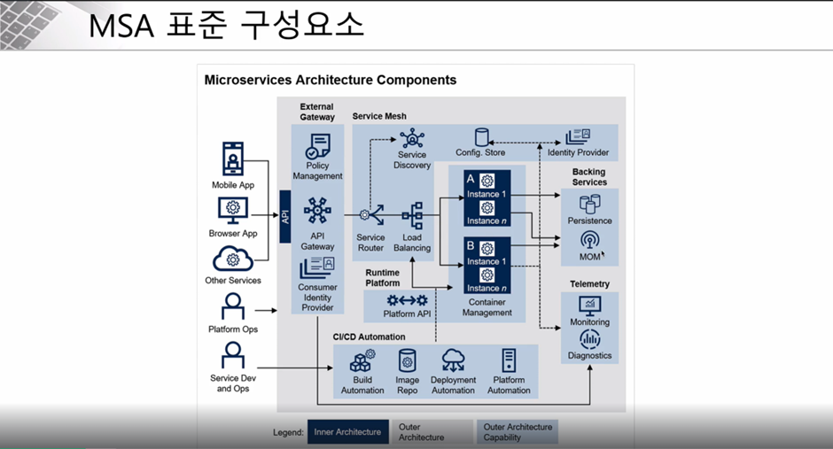
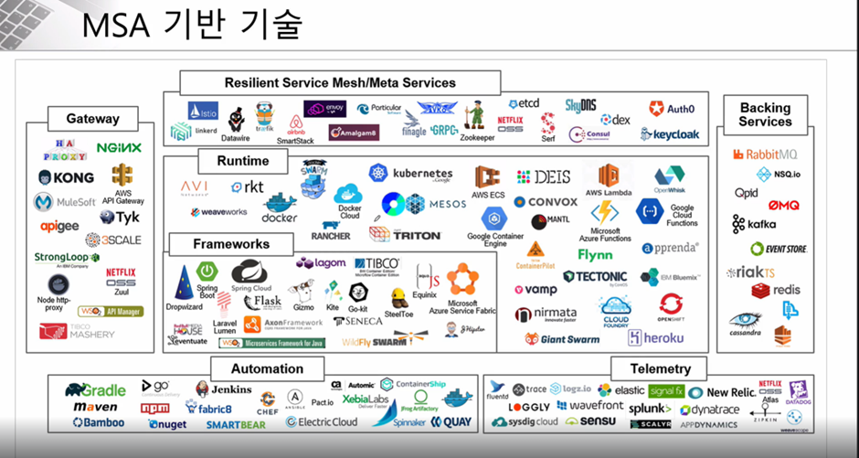
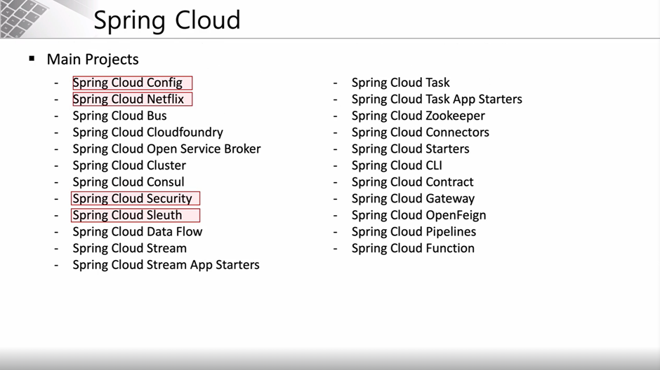
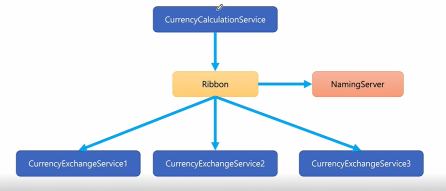

## 1. MSA 사용시 추가 개념

프론트 -> `BFF` 또는 `GraphQL` -> 백엔드(서비스별로)

event stream(ex.`Kafka`)과 같은 메세징 방식을 사용해 데이터 동기화

## 2. 구조설명

1. 모바일 앱 또는 브라우저앱 또는 다른 서비스들이 프론트 존재

2. API gateway를 통해 필요한 서비스에 요청

3. service router가 요청이 어디로 가야하는지 확인 -> service router는 service discovery에 물어봄(위치 검색)

4. 어디로 가야할 지 알았다면 해당 서비스에도 많은 instance가 존재할 것이므로 load balancing을 통해 어떤 서비스 instance로 전달할지 결정
   [backing system은 persistence로 마이크로서비스에 저장되어있는 다양한 저장소를 모아 사용하고, MOM을 통해 하나의 서비스와 다른 서비스가 연결]

5. 환경설정 정보는 외부 시스템에 저장

6. CICD를 통해 automation

## 3. Service Mesh

MSA를 적용한 시스템의 내부의 통신. 서비스 간의 통신을 추상화하고 안전하고 빠르고 신뢰성있게 해줌

=> 복잡한 내부 네트워크 제어/추적가능

## 4. MSA 관련 기술

## 5. Spring Cloud

독립적으로 MSA 아키텍처를 지원하는 프레임워크
아래 사진에서 마크된 프로젝트 사용해 구축할 것

#### 1) Centralized configuration management (환경 설정)

=> `Spring Cloud Config Server` 사용

=> 환경 설정(ex.gateway Id, token 등)을 한 곳의 저장소에 저장한 후 외부저장소(git)에 저장. 변경된 내용만 빌드하고 적용 가능. 유지보수 GOOD

#### 2) Location transparency (서비스 등록과 위치 정보 확인, 검색 등의 서비스를 위해 필요)

=> Naming server(`Eureka`) 서버 사용

#### 3) Load Balancing

=> `Spring Cloud Gateway` 사용

외부의 클라이언트 정보 또는 서비스의 정보가 게이트웨이를 통과해 마이크로서비스로 분산. 게이트웨이 서비스도 naming server에 등록해 위치 검색하는 용도로 사용

#### 4) Easier REST Clients (각각의 마이크로서비스 통신을 위해)

=> `FeignClient`

#### 5) Visibility and monitoring (시각화와 모니터링을 위해 분산, 추적)

=> `Zipkin Distributed Tracing` / `Netflix API gateway`

#### 6) Fault Tolerance (장애 발생시 빠르게 복구하기 위해)

=> `Hystrix`

## 6. 실습 시 설치해야할 SW

1. IntelliJ IDEA Ultimate

2. Git

3. VSCode

4. Postman

