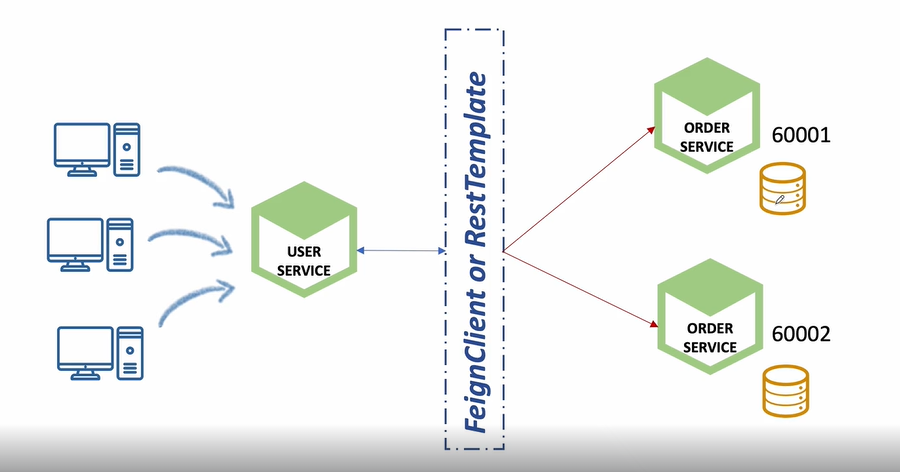
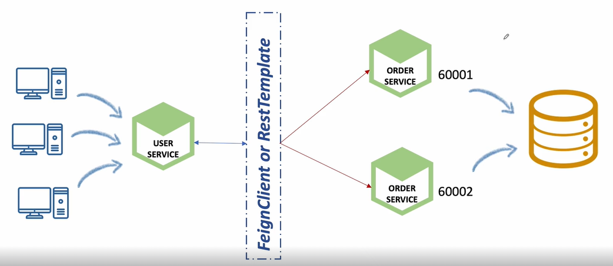
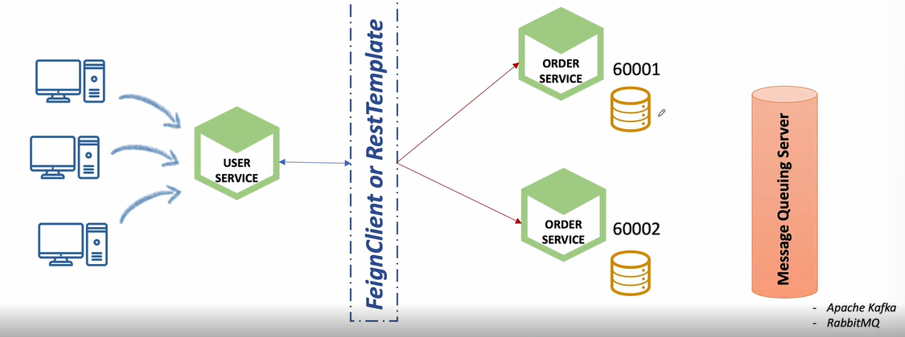
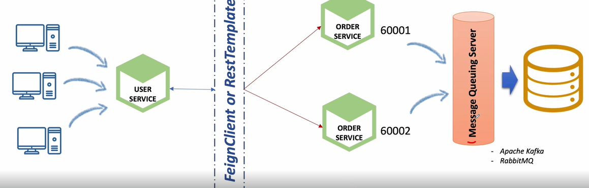

## 1. Communication types

1. Synchronous HTTP communication : 동기방식

✔️ 하나의 클라이언트 요청 사항이 들어오면 해당 요청이 처리될 때까지 다른 요청을 수행할 수 없음

2. Asynchronous communication over AMQP : 비동기방식

✔️ 서비스별로 순차적으로 처리하는 것이 아니라 AMQP와 연결된 모든 서비스에 데이터 전달

✔️ 클라이언트로부터 요청이 오면 user-service가 eureka에 order-service 위치를 묻고 정보를 받아 해당하는 order-service로 호출

=> Random port 사용할 때에는 Round Robin 방식으로 순차적으로 처리하거나 지역, 리소스 양, 시간에 따라 order-service 분산

3. Rest Template API 사용

✔️ 또다른 API 호출하기 위해 사용

✔️ 클라이언트가 사용자의 정보(ex.userId)에 따른 데이터를 요청하면, Rest Template을 사용해 order-service의 파라미터로 들어가 order-service로부터 데이터를 받아옴

## 2. RestTemplate 사용

✔️ user-service -> order-service

✔️ UsersController.java에서 `@GetMapping(value="/users/{userId}")`로 시작하는 경우, 사용자 정보 뿐 아니라 order-service에서 해당 userId의 주문 정보 가져오도록

1. userServiceApplication에 Bean 등록

```
@Bean
public RestTemplate getRestTemplate() {
    return new RestTemplate();
}
```

2. UsersServiceImpl.java

- config 파일(ex. user-service.yml, application.yml)에 아래 코드 정의

`user-service.yml`

```
order_service:
    url: http://127.0.0.1:[apigateway port]/order-service/%s/orders
```

`UsersServiceImpl.java`

```
//Environment와 RestTemplate 사용시 생성자 수정 필요
@Autowired
public UserServiceImpl(UserRepository userRepository, BCryptPasswordEncoder passwordEncoder, Environment env, RestTemplate restTemplate) {
    this.userRepository = userRepository;
    this.passwordEncoder = passwordEncoder;
    this.env = env;
    this.restTemplate = restTemplate;
}


//구성파일에서 environment 사용하는 경우 Environment 정의, RestTemplate 사용시 정의
Environment env;
RestTemplate restTemplate;

...

@Override
public UserDto getUserByUserId(String userId) {
    UserEntity userEntity = userRepository.findByUserId(userId);

    if (userEntity == null) {
        throw new UsernameNotFoundException("User not found);
    }

    UserDto userDto = new ModelMapper().map(userEntity, UserDto.class);

    //Using a restTemplate: 해당 부분 추가
    String orderUrl = String.format(env.getProperty("order_service.url"), userId);
    ResponseEntity<List<ResponseOrder>> orderListResponse = restTemplate.exchange(orderUrl, HttpMethod.GET, null, new ParameterizedTypeReference<List<ResponseOrder>>() {
    });

    List<ResponseOrder> ordersList = orderListResponse.getBody();
    userDto.setOrders(ordersList);
    return userDto;
}
```

3. 결과

✔️ POSTMAN에 `[IP주소]:8000/user-service/users/{userId}` 입력하면, email, name, userId 뿐만 아니라 orders까지 확인 가능

4. IP번호가 아닌 마이크로서비스 이름으로 url 설정

✔️ UserServiceApplication의 RestTemplate 설정의 @Bean 아래에 `@LoadBalanced` annotation 추가

✔️ user-service.yml의 코드 수정: 마이크로서비스명은 eureka 서버에서 확인 가능

`기존`

```
order_service:
    url: http://127.0.0.1:[apigateway port]/order-service/%s/orders
```

`수정 후`

```
order_service:
    url: http://ORDER-SERVICE/order-service/%s/orders
```

✔️ 테스트 : config가 변경되었으므로 POSTMAN으로 busrefresh POST

## 3. FeignClient 사용

1. FeignClient

✔️ REST Call을 추상화한 Spring Cloud Netflix 라이브러리

2. 사용방법

✔️ 호출하려는 HTTP Endpoint에 대한 Interface 생성

- Interface란 추상 메소드만 가지고 있는 자바 클래스의 독특한 형태

- 내용을 구현하는 것이 아니라 호출하려는 메소드의 이름 또는 반환값 명시

✔️ @FeignClient 선언

- interface 상단에 `@FeignClient` annotation 작성

3. Load balanced 지원

4. 실습

✔️ Spring Cloud Netflix 라이브러리 추가

`pom.xml`

```
<dependency>
    <groupId>org.springframework.cloud</groupId>
    <artifactId>spring-cloud-starter-openfeign</artifactId>
</dependency>
```

✔️ @FeignClient Interface 생성 준비

- `@EnableFeignClients` annotation 추가

`userServiceApplication`

```
@SpringBootApplication
@EnableDiscoveryClient
@EnableFeignClients
public class UserServiceApplication {
    ...
}
```

✔️ @FeignClient Interface 생성

- interface 생성

`user microservice`(사용하고자하는 마이크로서비스) 내에 `OrderServiceClient`(사용할 마이크로서비스 인터페이스) 생성 : 경로 = user-service > src > main > java > com.example.userservice > client > OrderServiceClient

```
@FeignClient(name="order-service") //name에 호출하고자하는 마이크로서비스 이름 넣기
public interface OrderServiceClient {

    @GetMapping("/order-service/{userId}/orders")   //마이크로서비스 이름이 order-service이고 해당 서비스에 존재하는 url 호출
    List<ResponseOrder> getOrders(@PathVariable String userId);
}
```

- userServiceImpl.java 수정

```
// 생성자에 OrderServiceClient(FeignClient의 인터페이스) 추가
@Autowired
public UserServiceImpl(UserRepository userRepository, BCryptPasswordEncoder passwordEncoder, Environment env, RestTemplate restTemplate, OrderServiceClient orderServiceClient) {
    this.userRepository = userRepository;
    this.passwordEncoder = passwordEncoder;
    this.env = env;
    this.restTemplate = restTemplate;
    this.orderServiceClient = orderServiceClient;
}

@Override
public UserDto getUserByUserId(String userId) {
    UserEntity userEntity = userRepository.findByUserId(userId);

    if (userEntity == null) {
        throw new UsernameNotFoundException("User not found);
    }

    UserDto userDto = new ModelMapper().map(userEntity, UserDto.class);

    <!-- //Using a restTemplate: 해당 부분 추가
    String orderUrl = String.format(env.getProperty("order_service.url"), userId);
    ResponseEntity<List<ResponseOrder>> orderListResponse = restTemplate.exchange(orderUrl, HttpMethod.GET, null, new ParameterizedTypeReference<List<ResponseOrder>>() {
    });
    List<ResponseOrder> ordersList = orderListResponse.getBody(); -->

    //Using a feignclient
    List<ResponseOrder> ordersList = orderServiceClient.getOrders(userId);

    userDto.setOrders(ordersList);
    return userDto;
}
```

## 4. FeignClient 예외처리

1. FeignClient에서의 로그 사용

`application.yml`

```
logging:
    level:
        com.example.userservice.client: DEBUG
```

`UserServiceApplication.java`

```
...
public class UserServiceApplication {
    ...
    @Bean
    public Logger.Level feignLoggerLevel() {
        return Logger.Level.FULL;
    }
}
```

⭐️ FeignClient 호출되었을 때 로그 확인 가능

2. 예외처리: URL 주소가 잘못된 경우

✔️ @GetMapping("/order-service/{userId}/orders-ng")의 경우 url이 잘못되어 주문 정보를 볼 수 없음. BUT 기존의 사용자 정보는 볼 수 있도록 하는 것이 적합

⭐️ try-catch로 FeignException 발생한 경우 예외처리

`UsersServiceImpl.java`

```
List<ResponseOrder> ordersList = null;
try {
    ordersList = orderServiceClient.getOrders(userId);
} catch (FeignException ex) {
    log.error(ex.getMessage());
}
```

## 5. ErrorDecoder 인터페이스를 이용한 예외 처리

1. ErrorDecoder 구현

✔️ FeignClient에서 발생한 에러를 상태 코드에 따라 처리

경로 = user-service > src > main > java > com.example.userservice > error > `FeignErrorDecoder.java`

```
public class FeignErrorDecoder implements ErrorDecoder {
    @Override
    public Exception decode(String methodKey, Response response) {
        switch (response.status()) {
            case 400:
                break
            case 404:
                if (methodKey.contains("getOrders")) {  //메소드키가 getOrders인 경우에 발생한 404인 경우만 처리
                    return new ResponseStatusException(HttpStatus.valueOf(response.status()), "User's orders is empty.");
                }
                break;
            default:
                return new Exception(response.reason());
        }
        return null;
    }
}
```

2. ErrorDecoder 사용 준비

`UserServiceApplication`에 Bean 등록

```
...
public class UserServiceApplication {
    ...
    @Bean
    public FeignErrorDecoder getFeignErrorDecoder() {
        return new FeignErrorDecoder();
    }
}
```

`UsersServiceImpl.java`

```
//try-catch 주석처리

//ErrorDecoder
List<ResponseOrder> orderList = orderServiceClient.getOrders(userId);
```

3. 오류 메세지 config에서 가져오기

✔️ 이전까지는 오류 메세지를 하드 코딩해서 가져왔지만 설정파일(application.yml)에 등록해서 사용하도록

`user-service.yml`
```
order_service:
    url: ...
    exception:
        orders_is_empty: User's orders is empty.
```

`FeignErrorDecoder.java`
```
@Component //생성자 주입하려면 해당 annotation 필요
public class FeignErrorDecoder implements ErrorDecoder {
    //config의 값을 가져올 것이므로 Environment 필요 => 생성자로 주입받는 것이 좋음
    Environment env;

    @Autowired
    public FeignErrorDecoder(Environment env) {
        this.env = env;
    }

    @Override
    public Exception decode(String methodKey, Response response) {
        switch (response.status()) {
            case 400:
                break
            case 404:
                if (methodKey.contains("getOrders")) {  //메소드키가 getOrders인 경우에 발생한 404인 경우만 처리
                    return new ResponseStatusException(HttpStatus.valueOf(response.status()), env.getProperty("order_service.exception.orders_is_empty"));
                }
                break;
            default:
                return new Exception(response.reason());
        }
        return null;
    }
}
```

`UserServiceApplication.java`

=> FeignErrorDecoder를 @Component로 등록했기에 @Bean으로 다시 등록할 필요 없으므로 주석 처리

4. config 파일을 수정할 경우 postman에서 busrefresh 한 번 post 한 후 진행

## 6. 데이터 동기화 문제 -1

1. 데이터 동기화 문제

✔️ Users에 여러 개의 요청이 들어와 Orders Service를 여러 포트에 띄우는 경우, Orders의 데이터도 분산되어 저장 => 데이터가 두가지 데이터베이스에 나누어 저장



2. 해결책 1 : 하나의 데이터 베이스 사용

✔️ 동시성, 트랜잭션 문제 관리해야함



3. 해결책 2 : Database 간의 동기화

✔️ 변경사항을 Message Queuing Server에 전달해 변경된 사항이 있는 경우 다른 DB에 데이터 전달



4. 해결책 3: Kafka Connector + 하나의 DB

✔️ 변경사항을 Message Queuing server에 전달하면 하나의 database에 저장



## 7. 데이터 동기화 문제 -2

1. order-service 2개 동작시킴

✔️ 인텔리제이 터미널에 `ls -l`로 목록 확인 > pom.xml 또는 src 확인 후 `mvn spring-boot:run`로 order-service 하나 더 실행

=> eureka에서 ORDER-SERVICE 2개 동작 확인

2. eureka에서 각 서비스 클릭 후 port 번호 뒤의 브라우저 url을 `/h2-console`로 변경해 DB 확인

3. 하나의 아이디로 order post 여러번

4. eureka에 있는 order-service의 DB 확인

✔️ 사용자 한 명이 여러 번 주문하는 경우에도 여러 DB에 RR(Round Robin 방식)으로 나눠져 저장