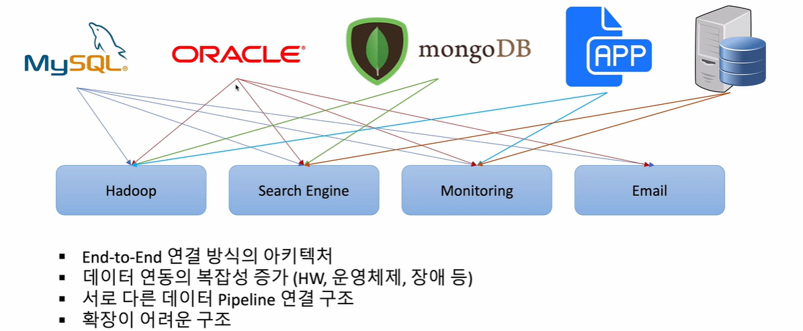
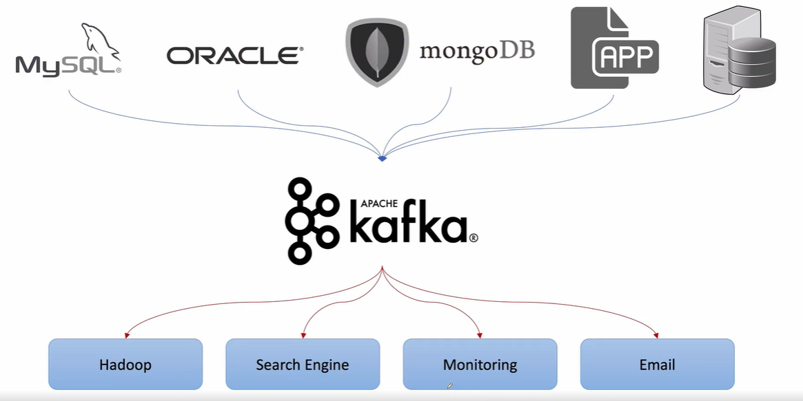
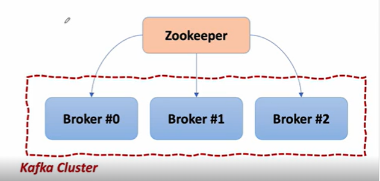
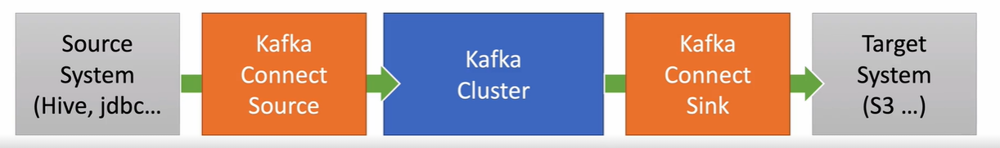

## 1. Apache Kafka 개요

1. Apache Kafka

✔️ Apache Software Foundation의 Scalar 언어로 된 오픈 소스 메세지 브로커 프로젝트

✔️ 메세지 브로커란 특정 리소스에서 다른 서비스(시스템)로 메세지를 전달할 때 사용하는 `서버`

✔️ 실시간 데이터 피드를 관리하기 위해 통일된 높은 처리량, 낮은 지연 시간을 지닌 플랫폼 제공

2. Kafka 이전

✔️ 다양한 리소스로부터 데이터를 받아 특정 시스템에 저장 

✔️ 단점

- End-to-End 연결 방식의 아키텍처

- 데이터 연동의 복잡성 증가 (HW, 운영체제, 장애 등)

- 서로 다른 데이터의 Pipeline 연결 구조

- 확장이 어려운 구조

⭐️ 따라서 모든 시스템으로 데이터를 실시간으로 전송하여 처리할 수 있는 시스템 & 데이터가 많아지더라도 확장이 용이한 시스템 => <span style="color:indianred">Kafka 등장</span>



3. Kafka 데이터 처리 흐름

✔️ MySQL, Oracle, mongoDB, application, database 등의 입장에서 자신이 전송하는 데이터가 어떠한 시스템에 저장되는지 상관없이 Kafka만 상대하면 됨

✔️ Kafka에서 다른 시스템으로 데이터 전송할 때 단일 포맷으로 전송 가능

✔️ 장점

- Producer/Consumer 분리

- 메세지를 여러 Consumer(Hadoop, Search Engine, Monitoring, Email 등)에게 허용 

- 높은 처리량을 위한 메세지 최적화

- Scale-out 가능

- Eco-system : 데이터 스트리밍, SQL 문법 제공 등 가능



4. Kafka Broker

✔️ 실행된 Kafka 애플리케이션 서버

✔️ 3대 이상의 Broker Cluster 구성 권장

- 하나의 Broker가 문제가 발생할 떄 다른 broker를 사용할 수 있도록

✔️ Zookeeper 연동

- 역할: Broker(서버)의 장애 체크, 복구 등을 관리하는 코디네이터, 메타데이터(Broker ID, Controller ID 등) 저장

✔️ n개의 Broker 중 1대는 Controller 기능 수행

- Controller => 각 Broker에게 담당 파티션 할당 수행 / Broker 정상 동작 모니터링 관리

⭐️ 즉, 메세지를 주고받을 때 저장되는 저장소로 `Kafka Broker`가 사용되고, 이러한 Broker를 중재하는 `Zookeeper` 사용



## 2. Apache Kafka 설치

1. `http://kafka.apache.org/`에서 2.7.0 버전 & Scala 2.13 버전 다운로드

- HTTP 방식으로 다운로드

2. `tar xvf kafka_2.13-2.7.0.tgz`로 압축 해제

## 3. Apache Kafka 사용 - Producer/Consumer

⭐️ Ecosystem 1 - Kafka Client

✔️ Kafka에 메세지를 보내면 Kafka가 저장하고 있다가 다른 consumer에 해당 메세지 전송

✔️ Kafka와 데이터 주고받기 위해 Java Library 사용

✔️ Producer, Consumer, Admin, Stream 등 Kafka 관련 API 제공

⭐️ Ecosystem 2 - Kafka Connect

✔️ Kafka에 메세지를 전송할 때 자바 프로그램을 통해 데이터를 받을 수 있지만, 데이터베이스에 변경사항(insert, update 등)이 생겼을 때 Kafka가 데이터베이스로부터 변경된 데이터 메세지를 가져와 전달

1. Kafka 서버 기동 (MAC)

✔️ Zookeeper 서버 구동 > Kafka 서버 구동 

```
//Zookeeper
$KAFKA_HOME/bin/zookeeper-server-start.sh   //zookeeper server
$KAFKA_HOME/config/zookeeper.properties     //zookeeper config file
//Kafka
$KAFKA_HOME/bin/kafka-server-start.sh       //kafka server
$KAFKA_HOME/config/server.properties        //kafka config file
```

✔️ Topic 생성

- producer가 kafka에 메세지를 전송하면 해당 데이터는 `Topic`이라는 곳에 저장

- 해당 topic을 구독한 consumer는 Topic에 저장된 데이터가 있을 경우 일괄 전송

- topic은 자유롭게 생성 가능: 아래 명령어는 topic을 'quickstart-events'라는 이름으로 생성

- partitions는 멀티 클러스터를 구성할 때 topic의 데이터를 몇군데에 나눠서 저장할지 

```
$KAFKA_HOME/bin/kafka-topics.sh --create --topic quickstart-events --bootstrap-server localhost:9092 \--partitions 1    //9092는 kafka server 기본 포트번호(현재 예제는 kafka와 zookeeper는 단일)
```

✔️ Topic 목록 확인

- 해당 서버가 가지고 있는 Topic 리스트 확인 가능 

```
$KAFKA_HOME/bin/kafka-topics.sh --bootstrap-server localhost:9092 --list
```

✔️ Topic 정보 확인

- 특정 topic의 상세 정보를 알고싶은 경우 topic명을 사용하여 정보 확인 가능

```
$KAFKA_HOME/bin/kafka-topics.sh --describe --topic [topic명] --bootstrap-server localhost:9092
```

2. Kafka서버 기동 (Windows)

✔️ Zookeeper 서버 구동 > Kafka 서버 구동 (Windows)

```
.\bin\windows\zookeeper-server-start.bat .\config\zookeeper.properties
.\bin\windows\kafka-server-start.bat .\config\server.properties
```

3. Producer/Consumer 테스트

- MAC 기준이므로 Windows의 경우 '.../bin/...'을 '.../bin/windows/...'로 사용하면 됨

✔️ 메세지 생산

- broker 서버 주소와 topic 이름 명시

```
./bin/kafka-console-producer.sh --broker-list localhost:9092 --topic quickstart-events
```

- 이후 `>` 이 나오면서 데이터를 입력할 수 있도록 되어있음

✔️ 메세지 소비

- broker 서버 주소와 topic 이름 명시

- `--from-beginning`은 처음부터 받아오기 위해

```
./bin/kafka-console-consumer.sh --broker-list localhost:9092 --topic quickstart-events \ --from-beginning
```

4. 실습 : MAC 기준

✔️ console 준비 : Windows에서는 Powershell 또는 cmd

- 압축해제되어있는 위치에서 console 실행

- Zookeeper 기동 console / Kafka 기동을 위한 console / producer를 위한 console / consumer를 위한 console 총 4개의 console 필요

✔️ 위의 console 순서대로 4개 실행

`Zookeeper`

- Zookeeper server port 확인 : 2181

```
./bin/zookeeper-server-start.sh ./config/zookeeper.properties
```

`Kafka`

- Kafka server port 확인 : 9092

```
./bin/kafka-server-start.sh ./config/server.properties
```

`Producer`
```
//현재 존재하는 topic 확인 -> 아직 topic 존재하지 않으므로 아무것도 X
./bin/kafka-topics.sh --bootstrap-server localhost:9092 --list

//topic 생성
./bin/kafka-topics.sh --bootstrap-server localhost:9092 --create --topic quickstart-events --partitions 1

//topic 확인 (위와 동일) -> quickstart-events 나타남
./bin/kafka-topics.sh --bootstrap-server localhost:9092 --list

//정보 보기 -> quickstart-events 토픽 정보 확인 가능
./bin/kafka-topics.sh --bootstrap-server localhost:9092 --describe --topic quickstart-events

//producer 구동 -> 이 다음부터 메세지 전달 가능
./bin/kafka-console-producer.sh --broker-list localhost:9092 --topic quickstart-events
> Hello, World //로 전달했을때(1)
```

`Consumer`
```
//consumer 구동 -> 구독한 서버에 데이터 변화가 존재하는 경우 해당 콘솔에 찍힘
./bin/kafka-console-consumer.sh --bootstrap-server localhost:9092 --topic quickstart-events --from-beginning
//Producer에서 Hello, World 전달
Hello, World
```

## 4. Apache Kafka 사용 - Kafka Connect

1. Kafka Connect

✔️ Data를 Import/Export 가능

✔️ 코드 없이 Configuration으로 데이터 이동 가능

✔️ Standalone mode, Distribution mode 지원

- RESTful API 통해 지원 -> postman 사용 가능

- Stream 또는 Batch 형태로 데이터 전송 가능

- 커스텀 Connector를 통한 다양한 Plugin 제공 (File, S3, Hive, MySQL, etc..)

✔️ 데이터를 Cluster로 가져오는(import) 쪽을 `Connect Source`, 데이터를 Cluster 외부로 보내는(export) 쪽을 `Connect Sink`라 부름



2. 실습

⭐️ Kafka Connect를 이용하여 하나의 DB에서 다른 DB로 데이터를 이동하는 실습 진행 : MariaDB 사용

✔️ MariaDB 설치 (MAC 기준)

```
//설치
$ brew install mariadb
//시작,종료,상태확인
$ mysql.server start, mysql.server.stop, mysql.server.status
//접속
$ mysql-uroot
//데이터베이스 생성
mysql > create database mydb;
```

📢 Access denied 발생한 경우
```
$ sudo mysql-u root
mysql > use mysql;
mysql > select user,host,plugin FROM mysql.user;
mysql > set password for 'root'@'localhost'=password('test1357');   //해당 비밀번호로 변경
mysql > flush privileges;   //위의 비밀번호 반영
```

✔️ MariaDB 설치 (Windows 기준)

- `https://mariadb.org/` 이동 후 Download

- Package Type: MariaDB Server 10.5.8 / Windows / x86_64 / Zip file 또는 MSI (MSI의 경우 간단. 비밀번호만 위의 값으로 설정)

📢 Zip file로 한 경우 복잡

- 다운받은 mariadb-10.5.8-winx64.zip 파일을 디렉토리로 이동 후 압축해제

- 관리자 모드로 cmd 실행 후 데이터 베이스 초기화 
```
.\bin\mariadb-install-db.exe --datadir=[디렉토리 경로] --service=mariaDB --port=3306 --password=test1357
```

- Windows Service 등록 확인

## 5. Orders Microservice에서 MariaDB 연동

## 6. Kafka Connect 설치 -1

## 7. Kafka Connect 설치 -2

## 8. Kafka Source Connect 사용

## 9. Kafka Sink Connect 사용