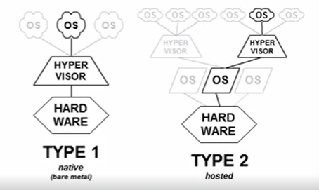
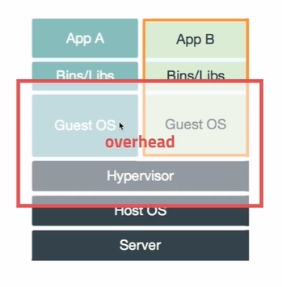
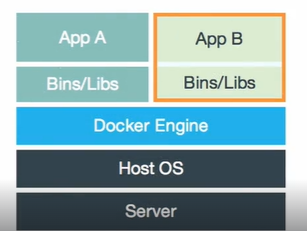
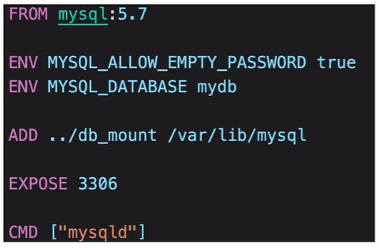
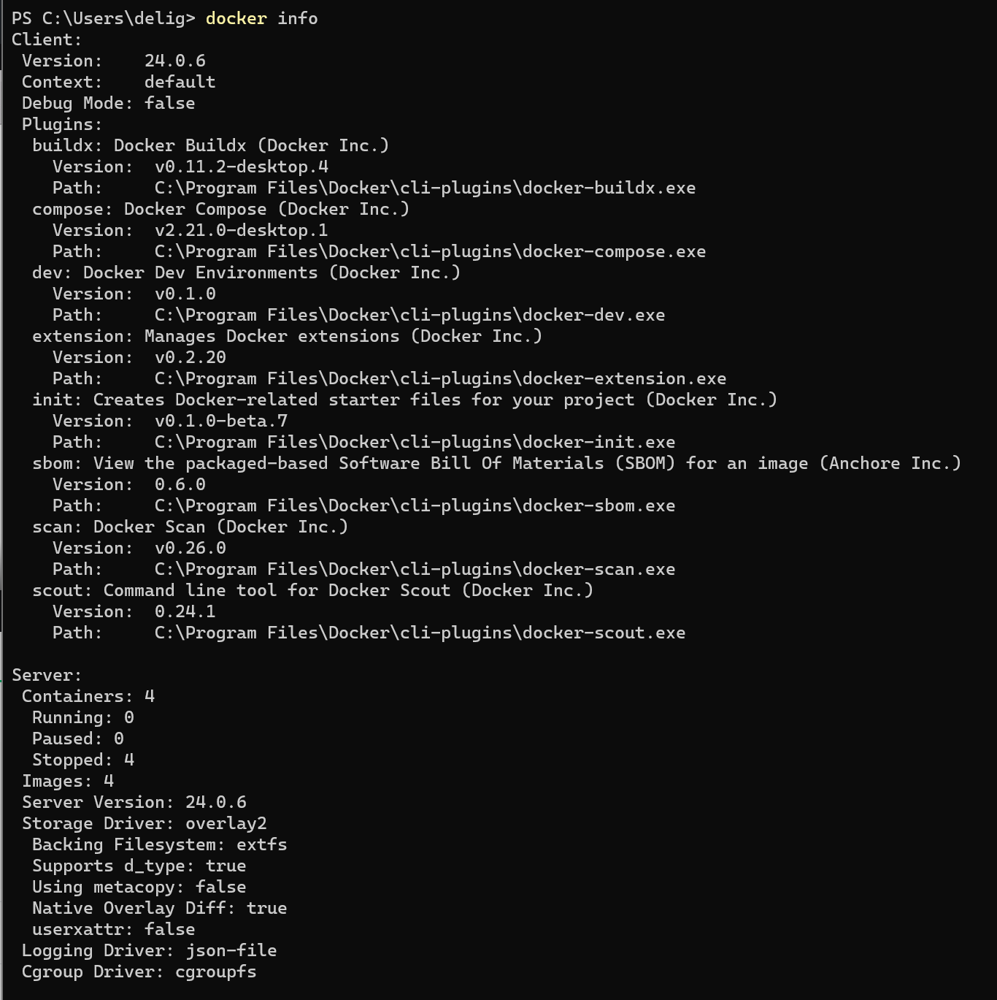
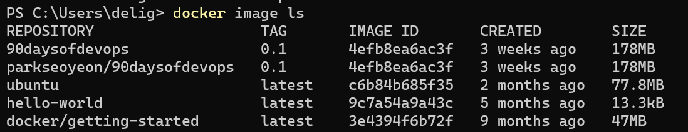
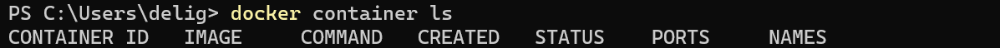
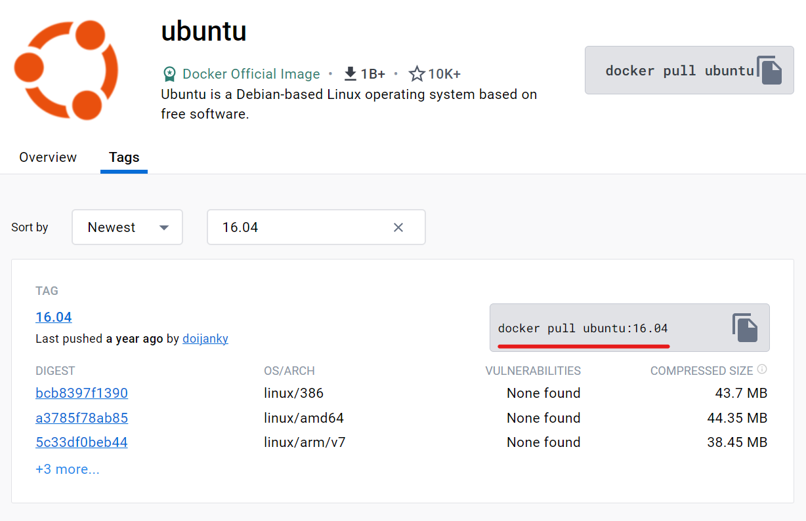
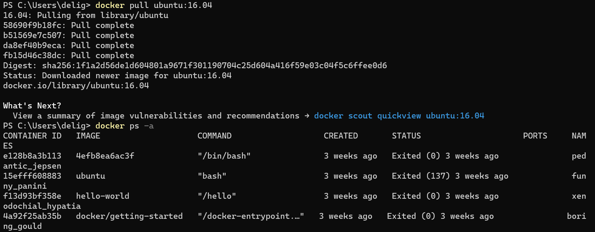

## 1. 컨테이너 가상화

1. Virtualization (가상화)

✔️ 물리적인 컴퓨터 리소스를 다른 시스템이나 애플리케이션에서 사용할 수 있도록 제공

- 플랫폼 가상화

- 리소스 가상화

✔️ 하이퍼바이저 (Hypervisor)

- 가상화를 하기 위한 매니저. Virtual Machine Manager (VMM)

- 다수의 운영체제를 동시에 실행하기 위한 논리적 플랫폼

- Type 1: Native or Bare-metal. 하드웨어에서 직접적으로 하이퍼바이저 설치

- Type 2: Hosted. 보통 Windows와 Mac에서 사용되는 하이퍼바이저



2. Container Virtualization

✔️ OS Virtualization (운영체제 가상화)

- Host OS 위에 Guest OS 전체를 가상화

- VMWare, VirtualBox => `hypervisor` 역할

- 자유도가 높으나, 시스템에 부하가 많고 느려짐 => Host OS 위에 Guest OS가 있는 경우 부하 증가



✔️ Container Virtualization

- Host OS가 가진 리소스를 적게 사용하며, 필요한 프로세스 실행

- 최소한의 라이브러리와 도구만 포함

- Container의 생성 속도 빠름

- Guest OS가 올라가는 것이 아니라 컨테이너를 실행할 수 있는 소프트웨어(ex.Docker Engine)가 올라감



3. Container <span style="color:indianred">Image</span>

✔️ Container Image란 컨테이너 실행에 필요한 설정 값을 모아둔 것

✔️ Image를 실체화해 사용할 수 있는 상태가 Container

- Image만 있으면 하나의 소프트웨어 또는 운영체제를 실행할 수 있음

✔️ Image를 업로드할 저장소 registry 필요

- Public Registry : Docker Hub

- Private Registry : Local

✔️ image를 사용할 수 있는 컨테이너 서버 => <span style="color:indianred">Docker Host</span>

- Docker host에는 host에서 실행할 수 있는 컨테이너가 저장된 로컬 레파지토리 존재

- 로컬 레파지토리에는 앞서 말한 public registry 또는 private registry의 이미지를 다운받아 저장

- 로컬에 저장한 이미지로 컨테이너 생성(`create`),실행(`start`), 컨테이너 생성+실행(필요한 경우 이미지 다운로드까지도 가능)(`run`)

4. <span style="color:indianred">Dockerfile</span>

✔️ Docker Image를 생성하기 위한 스크립트 파일

✔️ 자체 DSL(Domain-Specific language) 언어 사용 -> 이미지 생성 과정 기술

- 아래 언어에서 분홍색 글씨가 Command(instructor), 뒤의 내용이 실행하고자하는 내용

- 아래 언어 해석: [FROM] mysql 서버로부터 이미지 생성 > [ENV] 이미지 생성 시 필요한 환경 변수(ex.MYSQL_ALLOW_EMPTY_PASSWORD, MYSQL_DATABASE) 설정 > [ADD] 로컬에 가지고 있던 파일을 이미지에 업로드> [EXPOSE] 생성된 컨테이너가 외부에 공개되는 포트 > [CMD] 위의 코드가 모두 실행된 이후 해당 명령 실행



## 2. Docker 컨테이너

1. Docker Desktop 설치

- `https://www.docker.com/products/docker-desktop`에서 docker desktop 설치

2. 회원가입

3. Docker Desktop

- Containers/Apps : Image로 만든 컨테이너 종류

- Images : local 레파지토리에 도커 컨테이너에서 사용할 수 있는 이미지를 다운받은 것이 있는 경우 표시됨

- 상단 설정 : 자동 로그인 / 가상화에 할당할 리소스 / 외부 레파지토리 / 쿠버네티스

4. docker 확인

- powershell에 `docker info`



- `docker image ls` : 존재하는 image 목록 확인



- `docker container ls` : 현재 실행 중인 컨테이너 목록 확인



5. Docker 명령어

- 컨테이너 실행

`docker run [OPTIONS] IMAGE명[:TAG|@DIGEST] [COMMAND] [ARG...]`

⚡️ 원래 이미지 생성&실행은 `create`와 `start`가 있지만, `run`할 경우 이미지가 없을 경우 다운로드까지 포함하여 생성과 실행을 모두 해줌

⚡️ Tag는 버전과 같이 사용됨

|  옵션  |                          설명                          |
| :----: | :----------------------------------------------------: |
|   -d   |       detached mode 흔히 말하는 백그라운드 모드        |
|   -p   |          호스트와 컨테이너 포트 연결(포워딩)           |
|   -v   | 호스트와 컨테이너의 디렉토리를 연결(마운트). 파일공유  |
|   -e   |          컨테이너 내에서 사용할 환경변수 설정          |
| --name |                   컨테이너 이름 설정                   |
|  --rm  |           프로세스 종료시 컨테이너 자동 제거           |
|  -it   | -i와 -t를 동시에 사용한 것으로 터미널 입력을 위한 옵션 |
| --link |              컨테이너 연결[컨테이너:별칭]              |

ex. docker run Image:Tag => 이미지 다운로드(pull)할 필요없이 사용 가능
`$ docker run ubuntu:16.04`

⚡️ `hub.docker.com`에서 이미지 검색 가능

- ubuntu 검색 후 나오는 `docker pull ubuntu:16.04` 설치



`docker container ls -a` (= `docker ps -a`): 한번이라도 실행된 컨테이너 모두 나타냄 (현재 종료되었어도)



`docker container rm [CONTAINER ID]` : 컨테이너 삭제

## 3. 컨테이너 생성과 실행

1. Docker 실행

✔️ Docker를 이용해 MySQL DB 실행

`$ docker run -d -p 3306:3306 -e MYSQL_ALLOW_EMPTY_PASSWORD=true --name mysql mysql:5.7`

- `-d` : 로그 표시 안 되게 백그라운드에서 실행

- `-p 3306:3306` : 앞의 번호가 Host의 port, 뒤의 번호가 container의 port. Host PC에서 container에 접속하여 사용할 수 있도록

- `-e MYSQL_ALLOW_EMPTY_PASSWORD=true`: run 시키려는 이미지는 mysql 5.7로 반드시 root password가 지정되어있어야함. root password 지정하지 않도록 별도로 설정

- `--name mysql` : 컨테이너 이름을 mysql로 설정

- `mysql:5.7` : 실행하고자하는 이미지 (5.6 Tag를 가지고있는 mysql 이미지). 반드시 root password를 지정해줘야 함 => environment option 사용

`$ docker exec -it mysql bash`

- `exec` : 추가적으로 컨테이너에 command 전달

- `-it` : 터미널로 입력

- `mysql` : 컨테이너 이름 및 id

- `bash` : 어떤 command를 이용해 실행할지 => bash shell 사용

2. 실습 => maria db 사용. port 3306

`docker run -d -p 3306:3306 -e MYSQL_ALLOW_EMPTY_PASSWORD=true --name mariadb mariadb:latest`

📢 port in use 오류 발생

포트 번호를 이미 사용 중인 경우 OS의 port(앞의 port 번호) 변경

`docker run -d -p 13306:3306 -e MYSQL_ALLOW_EMPTY_PASSWORD=true --name mariadb mariadb:latest`

📢 이전에 mariadb라는 이름의 컨테이너가 존재하기에 `run`을 하면 다시 생성될 때 해당 이름이 이미 존재하므로 오류 발생 => 삭제 후 다시 run

`docker container rm [CONTAINER ID]`
`docker run -d -p 13306:3306 -e MYSQL_ALLOW_EMPTY_PASSWORD=true --name mariadb mariadb:latest`

- `docker ps -a` : 실행 중인 컨테이너 확인

- `docker logs [CONTAINER ID 또는 CONTAINER NAMES]` : 로그 확인

3. 컨테이너 실행

✔️ 아래 명령어로 컨테이너 실행하면, mysql의 경우 root ID로 접속되고 host name은 container ID로 설정됨. 컨테이너에 접속하는 것은 Guset OS를 쓰는 것과 비슷

`docker exec -it [CONTAINER NAMES] [실행할 command]`
`docker exec -it mariadb /bin/bash`

`root@[CONATINER ID]:/# [입력 대기]` => 이 상태가 컨테이너 실행 상태

✔️ maria db 접속

root@[CONATINER ID]:/# `mysql -uroot -p -h127.0.0.1` => `-p`는 password 하지만 없음. `-h`는 host 주소

root@[CONATINER ID]:/# `(enter)` => password 없기에 그냥 엔터

✔️ maria db 접속 완료

MariaDB [(none)] > `show databases;` => 존재하는 databases 확인
MariaDB [(none)] > `create database mydb;` => mydb라는 database 생성(table은 생성X)
MariaDB [(none)] > `exit`
root@[CONATINER ID]:/# `exit`

- host PC 상태

`docker ps -a` => container 확인

✔️ Host PC에서 접근한다고 가정 => `Workbench` 사용

- Connection Name을 `Docker -mariadb`, HostName을 `127.0.0.1`, Port를 `13306`로 test connection

- Host PC에서 접근할 때에는 `docker ps -a`에서 본 것과 같이 13306으로 접근 -> 컨테이너의 3306과 포트포워딩

- mydb라는 데이터베이스 확인 가능

✔️ 컨테이너 종료

`docker stop [CONTAINER NAMES]`
`docker stop mariadb`

- 이후 `docker ps -a`하면 STATUS Exited로 나타남

✔️ 컨테이너 삭제

`docker container rm mariadb`

- 이 경우 컨테이너 내의 모든 데이터가 삭제되므로 데이터가 필요한 경우 컨테이너 외부에 저장해야함

## 4. Docker 이미지 생성과 Public registry에 Push

1. Docker 이미지 생성 1 - Dockerfile 생성

✔️ user-service는 Java가 설치되어있어야 사용가능하므로 Java 기반의 Docker 이미지 파일 생성 => `FROM`

- `VOLUME`은 가상 저장소

- `COPY`는 Host directory에 존재하는 (앞의) 파일(디렉토리)를 container 내부의 (뒤의) 파일(디렉토리)로 복사

- `ENTRYPOINT`는 어떤 명령으로 도커를 실행할지 결정하는 실행 커맨드. 아래 예제에서는 'java'라는 명령으로 '-jar' 옵션으로 'users-service.jar'를 실행. 두번째 파라미터에는 필요한 경우 추가 명령 넣으면 됨. 현재는 안 써도 됨

```
FROM openjdk:8-jdk-alpine

VOLUME /tmp

COPY target/users-ws-0.1.jar users-service.jar

ENTRYPOINT ["java",
"-Djava.security.egd=file:/dev/./urandom",
"-jar",
"users-service.jar"]

```

2. Docker 이미지 생성 2 - 이미지 생성 및 업로드/불러오기

✔️ `$ docker build -t [저장할 위치]/[IMAGE NAME:TAG]`

`$ docker build -t edowon0623/users-service:1.0 .`

- 실제 이미지로 생성. 이미지 이름은 'seoyeon/users-service"1.0'

- 맨 뒤의 . 은 현재 디렉토리의 도커파일로 이미지를 생성하라는 의미

✔️ `$ docker push [docker hub 계정]/[IMAGE NAME:TAG]`

- `$ docker push edowon0623/user-service:1.0`

- docker hub에 이미지 업로드

✔️ `$ docker pull [docker hub 계정]/[IMAGE NAME:TAG]`

- `$ docker pull edowon0623/user-service:1.`

- docker hub에서 이미지 가져오기

3. 실습

✔️ Dockerfile 작성

- user-service > Dockerfile 폴더 생성 (target 폴더와 같은 depth)

- Docker Hub에서 openjdk 검색 후 17-ea-jdk-slim 버전 사용

```
FROM openjdk:17-ea-11-jdk-slim
VOLUME /tmp
COPY target/user-service-1.0.jar UserService.jar
ENTRYPOINT ["java","-jar","UserService.jar"]
```

✔️ 이미지 생성

- 해당 디렉토리로 이동 후 재빌드

`cd ../user-service`

`la -al` => target과 Dockerfile이 모두 존재

`mvn clean compile package -DskipTests=true` => 빌드: 필요한 jar 파일까지 생성. 이때 test 코드는 스킵(가끔 오류 발생할 수 있기 때문)

`ls -l ./target` => 생성된 user-service-0.0.1-SNAPSHOT.jar과 user-service-0.0.1-SNAPSHOT.jar.original 존재

jar 파일 이름 수정
`pom.xml`

```
<version>1.0</version>
```

다시 빌드 `mvn clean compile package -DskipTests=true`

`ls -l ./target` => 생성된 user-service-1.0.jar과 user-service-1.0.jar.original 존재

`docker build --tag edowon0623/user-service:1.0 .`로 이미지 생성

`docker image ls` 하면 edowon0623/user-service 존재

✔️ Docker Hub에 업로드

`docker push edowon0623/user-service:1.0`

- 이때 push 다음에는 [docker hub명]/[이미지명:버전] 이어야 함

✔️ 이미지 삭제 => Docker Hub에서 이미지를 pull 받는 것 확인

`docker rmi [IMAGE ID]`

`docker images` => edowon0823/user-service 존재x

✔️ 이미지 다운로드 (pull)

`docker pull edowon0623/user-service:1.0`

`docker images` => edowon0823/user-service 존재

✔️ 이미지 실행

`docker run edowon0623/user-service:1.0`

- 위 명령어는 포그라운드 실행이므로 로그가 뜸

`docker run -d edowon0623/user-service:1.0` 으로 할 경우 백그라운드로 실행되어 로그 발생 X

📢 어떤 식으로 실행하든 상관없지만 eureka, config server와 같이 먼저 실행되어야하는 서버가 실행되지 않아 오류 발생 => 다음 섹션에서 모든 서버 Docker Image로 만든 후 배포
