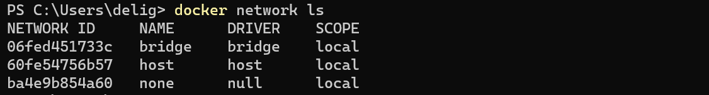
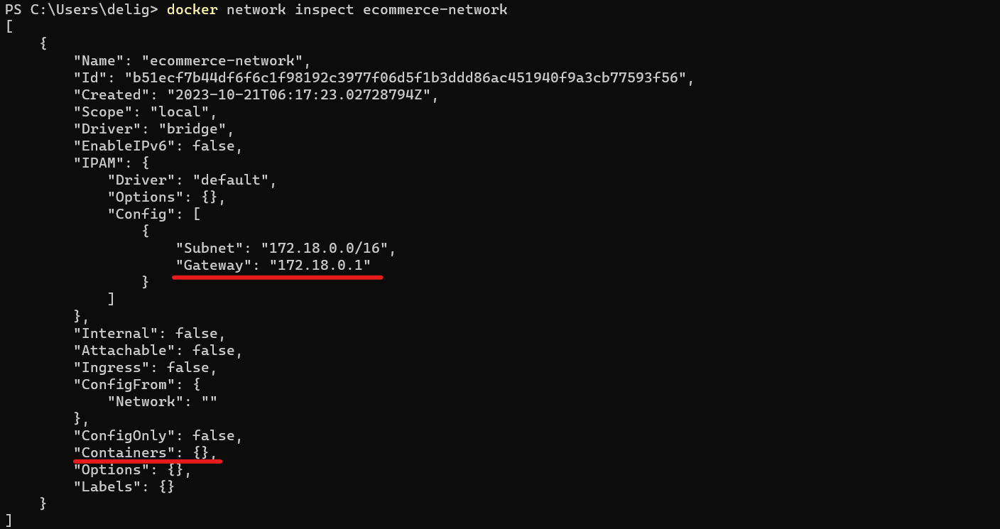
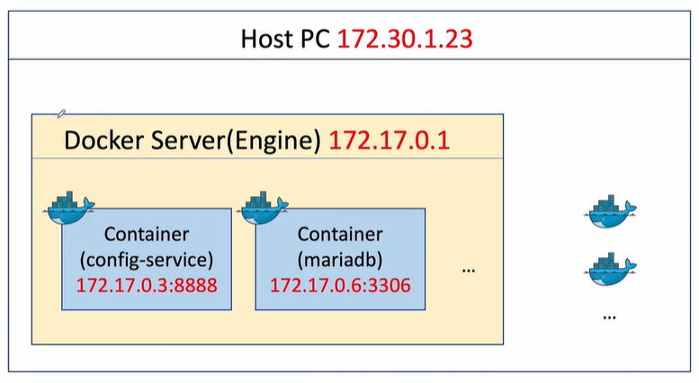
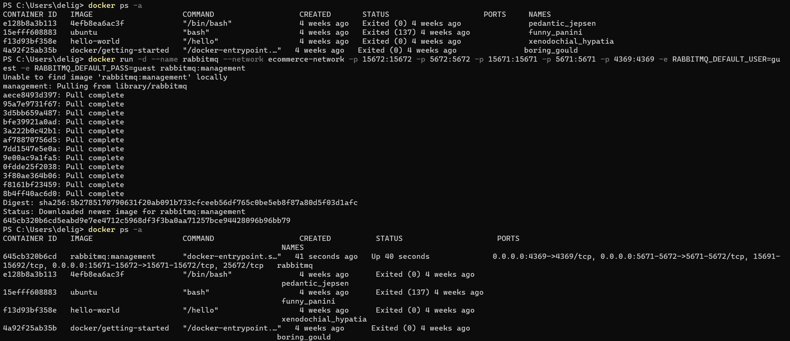
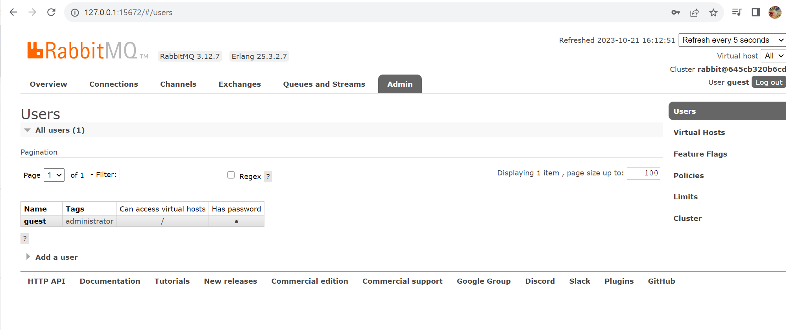

Docker 관련해서 `Powershell` 사용

## 1. 애플리케이션 배포 구성 

1. Running Microservices

✔️ microservice 실행 방법: IntelliJ IDEA, Exported JAR file, Docker Container

✔️ 배포를 위해 선택할 수 있는 전략: Local 또는 Public(ex.Amazon, Google)에 배포

🔥 `IntelliJ IDEA + Local` 
`JAR file + Local`
`Docker + Local` : 현재 강의에서 사용 => 이때 만든 도커 이미지를 그대로 컨테이너화시키고, 필요하다면 컨테이너화되어있던 것들을 오케스트레이션 툴(Swarm,Kubernetes)로 활용해 제어
`Docker + AWS EC2` : EC2라는 가상 서버를 만든 후 Docker 시스템 구축
`Docker + Docker Swarm Mode + AWS EC2` : multiclustering을 구축하기 위해 Swarm 기반 사용
`Docker + Kubernetes + AWS EC2` : 일반적

2. Running Microservices in Local

✔️ SpringBoot(Java) : Eureka, API Gateway, Configuration, Users Microservice, Catalogs Microservice, Orders Microservice

✔️ 서비스: RabbitMQ(데이터 동기화), MariaDB(DB), Kafka(데이터 전달), Zipkin(분산 트래핑 확인), Prometheus(모니터링), Grafana(모니터링)

⚡️ 현재까지는 IntelliJ와 maven을 이용해 테스트해봤지만, 이제 Docker container에 microservice와 Java 관련 어플리케이션을 `도커 이미지`로 만들고 서비스도 `도커 컨테이너화`시켜 기동

3. Docker network 생성

⚡️ 다양한 서비스들이 하나의 가상 네트워크를 가질 수 있도록 구축 => 서로 통신가능하도록

✔️ Docker network 종류

- Bridge network

    - 아무런 설정 없이 사용할 수 있는 네트워크. Host PC와 별도의 가상 네트워크

    - 가상 네트워크에서 컨테이너 배치해 사용

    - 생성하는 법: `docker network create --driver bridge [브릿지 이름]`

- Host network

    - Guest OS에서 Host OS의 네트워크 환경을 그대로 사용

    - 포트 포워딩없이 컨테이너화되어있는 애플리케이션을 Host OS에서 직접 제어해 사용

- None network

    - 네트워크를 사용하지 않음



✔️ Bridge network 생성

- subnet mask와 gateway 명시 가능. IP address를 수동으로 할당할 것을 예상하여 명시하는 것 권장

- `docker network create --gateway 172.18.0.1 --subnet 172.18.0.0/16 ecommerce-network`

    - gateway가 172.18.0.1이고 subnet이 172.18.0.0/16인 ecommerce-network 이름을 가진 bridge network 생성

✔️ bridge network 설정 시 장점
 
 - 일반적인 container는 하나의 guest OS로 간주하고 각각의 guest OS마다 고유한 IP address 할당

 - container는 IP address로 통신하게 되는데, 같은 네트워크에 포함된 컨테이너들은 IP address 이외의 <span style="color:indianred">container Id 또는 container 이름으로 통신할 수 있음 </span>

- 예를 들어, 아래 그림에서는 12개의 서비스가 존재하고 개별적으로 동작하는 컨테이너이기에  12개의 IP address가 할당됨

    - 이때 Docker에서 container로 배포하면 비어있는 IP부터 순차적으로 할당되어 환경이 변함에 따라 IP가 다르게 할당될 수 있음

    - IP address로 통신하는 경우, 다른 서비스가 변경된 IP를 호출할 때 변경된 값을 별도로 설정할 필요 있음

    - 만약 같은 네트워크의 경우 IP가 아닌 container 이름으로 호출할 수 있기에 수정할 필요 없음 => container는 `--name`으로 컨테이너 생성 시 이름 지정


✔️ `docker network inspect ecommerce-network`로 gateway, subnet, 네트워크에 추가된 container 확인 가능



✔️ 즉, 하나의 Docker engine에서 사용할 수 있는 가상의 네트워크(bridge network)를 생성하고 본 네트워크에 생성된 컨테이너 사이에는 IP address가 아닌 container name으로 통신(접속)할 수 있게 됨



## 2. RabbitMQ

⚡️ configuration service와 관련

⚡️ 설정 파일이 변경된 경우 모든 서비스에 변경 사항이 반영되도록 spring cloud bus 기능 사용 > spring cloud bus에서 사용하는 Message Queuing server가 RabbitMQ

⭐️ RabbitMQ 서비스를 Docker container화시키기 

✔️ RabbitMQ 홈페이지에서 Download + Installation 선택 > RabbitMQ Docker Image 선택 > 이동한 dockerhub에서 적절한 tag를 선택해 사용 => docker run 사용하는 경우 다운로드 안 해도 됨

✔️ `docker run -d --name rabbitmq --network ecommerce-network -p 15672:15672 -p 5672:5672 -p 15671:15671 -p 5671:5671 -p 4369:4369 -e RABBITMQ_DEFAULT_USER=guest -e RABBITMQ_DEFAULT_PASS=guest rabbitmq:management`

- `docker run` : 컨테이너 생성  + 실행 (이미지가 없는 경우 다운로드까지도)

- `-d` : 백그라운드에서 실행

- `--name rabbitmq` : 컨테이너 이름 rabbitmq

- `--network ecommerce-network` : docker network 지정해 container 생성

- `-p 15672:15672 -p 5672:5672 -p 15671:15671 -p 5671:5671 -p 4369:4369` : RabbitMQ 컨테이너 포트(: 뒤)와 Host OS 포트(: 앞) 포트 포워딩 

- `-e RABBITMQ_DEFAULT_USER=guest -e RABBITMQ_DEFAULT_PASS=guest` : 환경 변수로 RabbitMQ 접속하기 위한 user와 password 설정

- `rabbitmq:management` : 호출하고자 하는 이미지 이름. docker 실행 시 rabbitmq:management 태그를 갖는 이미지 다운로드 후 컨테이너 생성 및 실행



✔️ `docker network inspect ecommerce-network`

- rabbitmq 컨테이너가 ecommerce-network에 할당되고, IP로 gateway인 172.18.0.1 다음인 172.18.0.2가 할당됨을 알 수 있음


✔️ `docker ps -a`에 포트포워딩된 것을 확인했으므로 브라우저에 `127.0.0.1:15672` 검색하면 RabbitMQ 컨테이너에 접속


- Id, password를 이전에 설정한 guest로 입력하여 로그인 > Admin 누르면 해당 user가 administrator로 설정된 것 확인 가능



## 3. Configuration Service

⭐️ Config Server Docker Image File 생성 및 Docker Container 생성과 실행

1. Docker Image 생성

✔️ Dockerfile 생성

`Dockerfile`
```
FROM openjdk:17-ea-11-jdk-slim
VOLUME /tmp
COPY apiEncryptionKey.jks apiEncryptionKey.jks
COPY target/config-service-1.0.jar ConfigService.jar
ENTRYPOINT ["java","-jar","ConfigService.jar"]
```

- `COPY apiEncryptionKey.jks apiEncryptionKey.jks` : apiEncryptionKey.jks(셀프 인증에 필요했던 파일) 파일을 컨테이너의 루트 디렉토리로 복사

- `COPY target/config-service-1.0.jar ConfigService.jar` : target 아래의 export 되어있는 파일 복사

- `ENTRYPOINT ["java","-jar","ConfigService.jar"]` : 컨테이너에 존재하는 ConfigService.jar 실행

✔️ 기존 코드 수정

`pom.xml`
```
<artifactId>config-service</artifactId>
# 기존: <version>0.0.1-SNAPSHOT</version>
<version>1.0</version>
```

`bootstrap.yml`
```
encrypt:
    key-store:
        # 기존: location: file://${user.home}/Desktop/Work/keystore/apiEncryptionKey.jks
        location: file:/apiEncryptionKey.jks
        password: test1234
        alias: apiEncryptionKey
```

`application.yml`
```
...
cloud:
    config:
        server:
            ...
            git:
                #기존: uri: file://Users/downlee/Desktop/Work/git-local-repo
                uri: https://github.com/[github 계정명]/[github 레포지토리명]
                # 레포지토리가 private인 경우 username과 password 추가

```

✔️ IntelliJ의 터미널에 `docker build -t [계정명]/config-service:1.0 .`로 docker image 생성

- 계정명의 Dockerhub에 config-service:1.0의 이름을 가진 docker image 생성

- `-t` : -tag의 줄임

- `.` : 현재 디렉토리의 도커 파일 실행할 것을 의미

✔️ `docker images` 명령어로 생성된 이미지 확인 가능

2. docker container 생성 및 실행

✔️ Powershell에 `docker run -d -p 8888:8888 --network ecommerce-network -e "spring.rabbitmq.host=rabbitmq" -e "spring.profiles.active=default" --name config-service [계정명]/config-service:1.0`

- `-p 8888:8888` : 포트포워딩

- `--network ecommerce-network` : 네트워크 설정

- `-e "spring.rabbitmq.host=rabbitmq"` : 기존의 RabbitMQ의 IP address가 달라졌으므로 추가한 별도의 설정. 같은 네트워크에 존재하므로 `container 이름`으로 설정  

    - IntelliJ의 src/main/java/resources/application.yml의 spring.rabbitmq.host가 변화하였으므로 위의 코드로 수정

- `-e "spring.profiles.active=default"` : 기존과 동일하지만 이와 같이 환경변수 별도 설정 가능

- `--name config-service` : 컨테이너 이름 지정

- `[계정명]/config-service:1.0` : 컨테이너를 생성할 이미지 

3. 확인

- `docker ps -a` 명령어로 컨테이너 확인

- `docker images` 명령어로 이미지 확인

- `docker network inspect ecommerce-network` 명령어로 네트워크 확인

- 브라우저에 `127.0.0.1:8888/user-service/default` 입력해 configuration server 확인

## 4. Discovery Service

## 5. Apigateway Service

## 6. MariaDB

## 7. Kafka

## 8. Zipkin

## 9. Monitoring

## 10. Deployed Services

## 11. User Microservice

## 12. Order Microservice

## 13. Catalog Microservice

## 14. Test

## 15. Multi Profiles