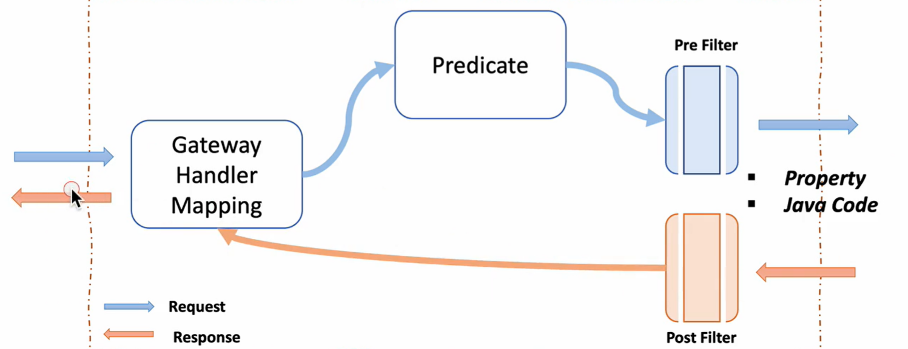

## 1. API Gateway란?

1. API Gateway Service

1) 역할

- 사용자가 설정한 라우팅 설정에 따라 각 엔드포인트로 클라이언트 대신해 요청하고, 응답 받으면 다시 클라이언트에게 전달해주는 프록시 역할
- 시스템의 내부 구조는 숨기고 외부 요청에 대해 적절한 형태로 가공해서 응답해줄수 있음

- 각각의 마이크로서비스로 요청되는 모든 정보를 일괄적으로 처리

2. 동작
   프론트엔드(client mobile app, client SPA Web app, 전통적인 web app 등)는 직접적으로 마이크로서비스를 호출하지 않고, API gateway만 상대

3. 장점

- 인증 및 권한 부여
- 서비스 검색 통합
- 응답 캐싱
- 정책, 회로 차단기 및 QoS 다시 시도
- 속도 제한
- 부하 분산
- 로깅, 추적, 상관관계
- 헤더, 쿼리 문자열 및 청구 변환
- IP 허용 목록에 추가

2. Neflix Ribbon

1) Spring Cloud에서의 MSA 간 통신
   : 마이크로서비스 사이의 통신

- RestTemplate
  : 하나의 웹 어플리케이션에서 다른 웹 어플리케이션을 사용하기 위해 사용되는 API

```
//인스턴스 생성
RestTemplate restTemplate = new RestTemplate();
//접속하고자하는 서버의 주소와 포트번호, 파라미터까지 전달
restTemplate.getForObject("http://localhost:8080/", User.class, 200);
```

- Feign Client
  : 특정 인터페이스를 생성해 추가적으로 등록하고 싶은 마이크로서비스 이름을 @FeignClient에 등록 => 하나의 마이크로서비스가 자신이 가진 API인 것처럼 자유롭게 사용 가능

```
@FeignClient("stores")
public interface StoreClient {
    @RequestMapping(method=RequestMethod.Get, value="/stores")
    List<Store> getStores();
}
```

2. Ribbon (Client side Load Balancer)
   : API Gateway를 별도로 구축하지 않고 client 내부에 Ribbon이라는 서비스를 구축하여 사용함으로써 직접적인 서비스와 통신하지 않고 간접적으로 통신 가능

- 마이크로서비스 이름으로 호출 가능한 로드밸런서
- health check 가능
  ㄴ 할당하는 서비스가 정상적으로 동작 중인지 확인

🚫 Spring Cloud Ribbon은 Spring Boot 2.4에서 Maintenance 상태(사용할 수 있을지 없을지 모름)

3. Netflix Zuul
   : API Gateway 역할

1) 기능

- Routing
- API gateway

🚫 Spring Cloud Zuul은 Spring Boot 2.4에서 Maintenance 상태(사용할 수 있을지 없을지 모름)

⚡️ Ribbon은 Spring Cloud Loadbalancer, Zuul은 Spring Cloud Gateway로 대체해 사용

## 2. Netflix Zuul 실습

- eureka 사용하지 않지만 일단 넣기 => 후에 사용

1. 환경설정

- Spring Boot: 2.3.8
- Dependencies: Lombok, Spring Web, Eureka Discovery Client

2. Service 생성

1) First Service

- FirstServiceController (FirstServiceApplication과 동일 위치)

```
@RestController
@RequestMapping("/)
public class FirstServiceController {
    @GetMapping("/welcome")
    public String welcome() {
        return "Welcome to the First Service";
    }
}
```

- application.yml

```
server:
    port: 8081

spring:
    application:
        name: my-first-service

eureka:
    client:
        register-with-eureka: false
        fetchRegistry: false
```

2. Second Service

- SecondServiceController (SecondServiceApplication과 동일 위치)

```
@RestController
@RequestMapping("/)
public class SecondServiceController {
    @GetMapping("/welcome")
    public String welcome() {
        return "Welcome to the Second Service";
    }
}
```

- application.yml

```
server:
    port: 8082

spring:
    application:
        name: my-second-service

eureka:
    client:
        register-with-eureka: false
        fetchRegistry: false
```

3. Test
   브라우저에 `IP:8081/welcome` 과 `IP:8082/welcome` 입력

4. 환경설정

- Spring Boot: 2.3.8
- Dependencies: Lombok, Spring Web, Zuul

5. Service 생성

1) Application 실행 클래스에 `@EnableZuulProxy` 추가

2) application.yml

```
server:
    port: 8000

spring:
    application:
        name: my-zuul-service

//가장 중요
zuul:
    routes:
        first-service:
            path: /first-service/**
            url: http://localhost:8081
        second-service:
            path: /second-service/**
            url: http://localhost:8082
```

6. Test
   브라우저에 `IP주소:8000/first-service/welcome` 과 `IP주소:8000/second-service/welcome` 입력
   => 처음 주소에서는 first Service가, 두번째에서는 secondService가 실행됨

7. ZuulFilter
   : 사전처리, 사후처리 가능 ex. 인증, 로깅

- com.example.zuulservice > filter > ZuulLoggingFilter
- 마우스 우클릭 > Generate(ctrl+n) > implement Methods : 클래스 안의 메소드 자동 완성

```
@Component
public class ZuulLoggingFilter extends ZuulFilter {

    //run()은 사용자가 실행할때마다 실행
    @Override
    public Object run() throws ZuulException {
        log.info("************ printing logs: ");

        //사용자가 요청한 URI 보여줌
        RequestContext ctx = RequestContext.getCurrentContext();
        HttpServletRequest request = ctx.getRequest();
        log.info("************ "+ request.getRequestURI());
        return null;
    }

    @Override
    public String filterType() {
        return "pre";
    }

    @Override
    public int filterOrder() {
        return 1;
    }

    @Override
    public boolean shouldFilter() {
        return true;
    }

}
```

## 3. Spring Cloud Gateway란?

- Spring Cloud Gateway를 사용하는 주된 목적은 비동기 처리가 가능하기 때문. Zuul은 동기 방식
  => 따라서 Zuul 실행 시에는 tomcat 실행되었지만, Spring Cloud Gateway 사용시 Netty 실행

1. 환경설정

- Spring Boot: 2.4.2
- Dependencies: DevTools, Eureka Discovery Client, `Gateway`

2. Service 생성

1) 위에서 생성한 FirstService와 SecondService 의 RequestMapping만 변경
   ㄴ application.yml에서의 코드는 조건이 맞을 경우 `http://localhost:8081/first-service/welcome`와 같이 동작하기 때문. RequestMapping을 수정하지 않을 경우는 `http://localhost:8081/welcome`

```
@RestController
@RequestMapping("/first-service")
public class FirstServiceController {
    ...
}
```

```
@RestController
@RequestMapping("/second-service")
public class SecondServiceController {
    ...
}
```

2. application.yml

```
server:
    port: 8000

eureka:
    client:
        register-with-eureka: false
        fetch-registry: false
        service-url:
            defaultZone: http://localhost:8761/eureka

spring:
    application:
        name: gateway-service
    cloud:
        gateway:
            routes:
                - id: first-service
                  uri: http://localhost:8081/
                  predicates:                     //조건: path 정보가 first-service로 시작하는 경우
                      - Path=/first-service/**
                - id: second-service
                  uri: http://localhost:8082/
                  predicates:
                      - Path=/second-service/**
```

3. Test
   브라우저에 `IP주소:8000/first-service/welcome` 작성시 FirstService로 이동

## 4. Spring Cloud Gateway - Filter 적용 (java code)

- 현재 application.yml에 routing 정보만 존재
- 자바 코드에서도 routing 정보와 filter까지 활용 가능

1. Spring Cloud gateway의 구조

- Pre Filter 이후 Post Filter 이전에는 Servlet(Controller 동작)이 존재



2. 코드 수정

1) application.yml에서 실행하던 코드(아래)를 Java 코드로 실행 가능 => yml에서 주석처리 후 실행

```
spring:
    cloud:
        ...
```

2. Java Code 사용한 filter : com.example.apigatewayservice > config > FilterConfig.java

- 위 코드에서 Gateway Handler Mapping 시 request 헤더를 추가하고, response 보낼 때 response 헤더값을 넣어 반환

```
@Configuration  //해당 annotation을 모두 모아 메모리에 등록
public class FilterConfig {
    @Bean
    public RouteLocator gatewayRoutes(RouteLocatorBuilder builder) {
        return builder.routes()
            //`/first-service`로 시작하는 경우 아래의 두 작업 추가. path 확인 후 uri로 이동. filters를 통해 requestHeader와 responseHeader 추가(key("first-request")-value("first-request-header") 형태)
            .route(r -> r.path("/first-service/**")
                .filters(f-> f.addRequestHeader("first-request", "first-request-header")
                    .addResponseHeader("first-response", "first-response-header"))
                .uri("http://localhost:8081/"))

            //`/second-service`로 시작하는 경우 아래의 두 작업 추가
            .route(r -> r.path("/second-service/**")
                .filters(f-> f.addRequestHeader("second-request", "second-request-header")
                    .addResponseHeader("second-response", "second-response-header"))
                .uri("http://localhost:8082/"))
            .build();
    }
}
```

3. FirstServiceController.java와 SecondServiceController.java 수정
   : servlet(controller)에서 헤더가 출력이 되도록

(1) FirstServiceController.java

```
@RestController
@RequestMapping("/first-service")
public class FirstServiceController {
    @GetMapping("/welcome")
    public String welcome() {
        return "Welcome to the First Service";
    }

    @GetMapping("/message")
    public String message(@RequestHeader("first-request") String header) {
        System.out.println(header);
        return "Hello World in First Service";
    }
}
```

(2) SecondServiceController.java

```
@RestController
@RequestMapping("/second-service")
public class SecondServiceController {
    @GetMapping("/welcome")
    public String welcome() {
        return "Welcome to the Second Service";
    }

    @GetMapping("/message")
    public String message(@RequestHeader("second-request") String header) {
        System.out.println(header);
        return "Hello World in Second Service";
    }
}
```

2. Test
   브라우저에 `IP:8000/first-service/message` 입력 시 헤더값이 나타나는지 확인

=> 처음에 header가 없었는데 Spring Cloud Gateway에서 추가된 header를 확인해보는 것
=> response header는 브라우저의 개발자 도구 > Network 에서 확인 가능

## 4. Spring Cloud Gateway - Filter 적용 (application.yml)

- application.yml에서도 라우팅과 filter 기능 가능

- FilterConfig.java의 @Configuration과 @Bean만 주석 처리 후 진행 => filter 기능 X
- application.yml에서 주석처리한 부분 주석 취소

1. application.yml

```
spring:
    application:
        name: gateway-service
    cloud:
        gateway:
            routes:
                - id: first-service
                  uri: http://localhost:8081/
                  predicates:                     //조건: path 정보가 first-service로 시작하는 경우
                      - Path=/first-service/**
                  filters:
                    - AddRequestHeader=first-request, first-request-header2  //first-request 이름의 header 값이 first-request-header2
                    - AddResponseHeader=first-response, first-response-header2
                - id: second-service
                  uri: http://localhost:8082/
                  predicates:
                    - Path=/second-service/**
                  filters:
                    - AddRequestHeader=second-request, second-request-header2
                    - AddResponseHeader=second-response, second-response-header2
```

## 4. Spring Cloud Gateway - Custom Filter 적용

- 원하는 route 정보에 개별적으로 등록해야함 (cf. globalFilter는 공통적으로 등록 가능)

com.example.apigatewayservice > filter > CustomFilter
generate > implement method에서 apply 메소드 호출

1. 코드 수정

1) CustomFilter.java

```
//extends 해야함
@Component
public class CustomFilter extends AbstractGatewayFilterFactory<CustomFilter.Config> {
    public CustomFilter() {
        super(Config.class);
    }

    public static class Config {
        //Put the configuration properties
    }


    //구현시 apply
    @Override
    public GatewayFilter apply(Config config) {
        //Custom Pre Filter
        return (exchange, chain) -> {       //exchange는 request, chain은 response
            ServerHttpRequest request = exchange.getRequest();
            ServerHttpRequest response = exchange.getResponse();

            log.info("Custom PRE filter: request id -> {}", request.getId());

            //Custom Post Filter
            return chain.filter(exchange).then(Mono.fromRunnable(() -> {
                log.info("Custom POST filter: response code -> {}", response.getStatusCode());
            }));
        };
    }
}
```

2. application.yml

```
spring:
    application:
        name: gateway-service
    cloud:
        gateway:
            routes:
                - id: first-service
                  uri: http://localhost:8081/
                  predicates:                     //조건: path 정보가 first-service로 시작하는 경우
                      - Path=/first-service/**
                  filters:
                    <!-- - AddRequestHeader=first-request, first-request-header2  //first-request 이름의 header 값이 first-request-header2
                    - AddResponseHeader=first-response, first-response-header2 -->
                    - CustomFilter
                - id: second-service
                  uri: http://localhost:8082/
                  predicates:
                    - Path=/second-service/**
                  filters:
                    <!-- - AddRequestHeader=second-request, second-request-header2
                    - AddResponseHeader=second-response, second-response-header2 -->
                    - CustomFilter
```

3. FirstServiceController.java와 SecondServiceController.java에 각각 아래 코드 추가

```
@GetMapping("/check")
public String check() {
    return "Hi, there. This is a message from First Service";
}
```

```
@GetMapping("/check")
public String check() {
    return "Hi, there. This is a message from Second Service";
}
```

2. Test
   `http://localhost:8000/first-service/check`와 `http://localhost:8000/second-service/check`

## 5. Spring Cloud Gateway - Global Filter 적용

GlobalFilter.java

```
//extends 해야함
@Component
public class GlobalFilter extends AbstractGatewayFilterFactory<GlobalFilter.Config> {
    public GlobalFilter() {
        super(Config.class);
    }


    //구현시 apply
    @Override
    public GatewayFilter apply(Config config) {
        //Global Pre Filter
        return (exchange, chain) -> {       //exchange는 request, chain은 response
            ServerHttpRequest request = exchange.getRequest();
            ServerHttpRequest response = exchange.getResponse();

            log.info("Global Filter baseMessge: {}", config.getBaseMessage());
            if (config.isPreLogger()) {
                log.info("Global Filter Start: request id -> {}", request.getId());
            }

            //Gloabl Post Filter
            return chain.filter(exchange).then(Mono.fromRunnable(() -> {
                if (config.isPostLogger()) {
                    log.info("Global Filter End: response code -> {}", response.getStatusCode());
                }
            }));
        };
    }

    @Data
    public static class Config {
        private String baseMessage;
        private boolean preLogger;
        private boolean postLogger;
    }
}
```

application.yml

```
spring:
    application:
        name: gateway-service
    cloud:
        gateway:
            default-filters:
                - name: GlobalFilter
                  args:
                    baseMessage: Spring Cloud Gateway Global Filter
                    preLogger: true
                    postLogger: true
            routes:
                - id: first-service
                  uri: http://localhost:8081/
                  predicates:                     //조건: path 정보가 first-service로 시작하는 경우
                      - Path=/first-service/**
                  filters:
                    <!-- - AddRequestHeader=first-request, first-request-header2  //first-request 이름의 header 값이 first-request-header2
                    - AddResponseHeader=first-response, first-response-header2 -->
                    - CustomFilter
                - id: second-service
                  uri: http://localhost:8082/
                  predicates:
                    - Path=/second-service/**
                  filters:
                    <!-- - AddRequestHeader=second-request, second-request-header2
                    - AddResponseHeader=second-response, second-response-header2 -->
                    - CustomFilter
```

## 6. Spring Cloud Gateway - Load Balancer

** Spring Cloud Gateway와 Eureka 연동**

- client에서 API Gateway로 요청 -> Eureka Server에서 해당 서비스 위치 검색 -> 얻은 위치로 forward

- Eureka 역할: Service Discovery + Registration

1. 환경 설정

1) pom.xml : Spring Cloud Gateway, First Service, Second Service

```
<dependency>
    <groupId>org.springframework.cloud</groupId>
    <artifactId>spring-cloud-starter-netflix-eureka-client</artifactId>
</dependency>
```

2. application.yml : Spring Cloud Gateway, First Service, Second Service

```
eureka:
    client:
    register-with-eureka: true
    fetch-registry: true
    service-url:
        defaultZone: http://localhost:8761/eureka
```

3. application.yml : Spring Cloud Gateway

```
...
    cloud:
        gateway:
            default-filters: <1 item>
            routes:
                - id: first-service
                  uri: lb://MY-FIRST-SERVICE    //discover에 등록되어있는 이름으로 설정
                  predicates:
                    - Path=/first-service/**
                  filters: <1 item>
                - id: second-service
                  uri: lb://MY-SECOND-SERVICE
                  predicates:
                    - Path=/second-service/**
                  filters: <2 items>
```

4. Service 등록 확인

- Spring Cloud Gateway, First Service, Second Service 순차적으로 실행 및 Eureka 확인

브라우저에 `IP주소"8761`으로 Eureka 확인

2. Spring Cloud Gateway 정리

- apigateway-service의 application.yml의 routes/uri를 lb://MY-FIRST-SERVICE 와 같이 eureka에 지정된 이름으로 설정
- firstService의 application.yml의 server: port: 0으로 설정해 랜덤 설정 => RoundRobin으로 번갈아가면서 선택됨
