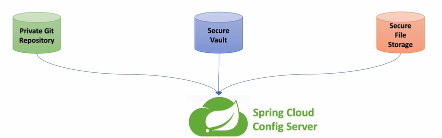

## 1. Configuration Service

- 각각의 마이크로서비스가 가지고 있어야할 `구성 정보 파일(yaml파일)`이 변경될 경우 application 자체가 다시 빌드되고 배포되어야 함 => 효율적X

- application 내부에 구성 파일을 가지고 있는 것이 아니라 외부에 있는 시스템을 통해 구성 파일 정보 관리

1. Spring Cloud Config

- 분산 시스템에서 서버, 클라이언트 구성에 필요한 설정 정보(application.yml)를 외부 시스템에서 관리

- 하나의 중앙화된 저장소에서 구성 요소 관리 가능

- 각 서비스를 다시 빌드하지 않고 바로 적응 가능

- 애플리케이션 배포 파이프라인을 통해 `DEV - UAT - PROD`(개발-테스트-프로덕션) 환경에 맞는 구성 정보 사용

2. Config 값

ex. IP, value, URL, userId, DB

3. 환경 설정 정보 저장소

- Git Repository : 일반적으로 사용

- Secure Vault : 암호화된 데이터

- Secure File Storage : 가지고있는 로컬 파일 디렉토리

⭐️ 위의 세가지 Config 저장소에 저장된 설정 값을 Dev와 Production에 각각 적용 => application_dev.yml과 application_prod.yml을 각각 만들어 배포 (적용)



## 2. Local Git Repository

1. 디렉토리 생성

```
//디렉토리 생성
$ /[경로]/git-local-repo

//디렉토리 입장
$ cd git-local-repo

//git으로 관리
$ git init
```

아래와 같이 ecommerce.yml 파일 생성

```
token:
    expiration_time: 86400000
    secret: user_token

gateway:
    ip: 192.168.0.8
```

```
//ecommerce.yml 파일 add
$ git add ecommerce.yml

//commit
$ git commit -m "upload an application yaml file"
```

2. Spring Cloud Config Project 생성

- Dependencies: Spring Cloud Config > Config Server

- dependency

```
<dependency>
    <groupId>org.springframework.cloud</groupID>
    <artifactId>spring-cloud-config-server</artifactId>
</dependency>
```

- ConfigServiceApplication.java 파일 수정

```
@SpringBootApplication
@EnableConfigServer //추가
public class ConfigServiceApplication {
    public static void main(String[] args) {
        SpringApplication.run(ConfigServiceApplication.class, args);
    }
}
```

- application.yml : 모든 서비스의 configuration을 관리하는 서비스 역할

```
server:
    port: 8888

spring:
    application:
        name: config-service
    //여기부터 중요
    cloud:
        config:
            server:
            git:
                uri: file://[경로]/git-local-repo
```

3. 우선순위

- application.yml -> [application-name].yml -> [application-name-profile].yml

- 위와 같이 yml 파일명 설정 가능

ex. application.yml / user-service.yml / user-service-dev.yml

4. 확인

브라우저에 `[IP주소]/[yml파일명]/[profile]`

- `127.0.0.1:8888/ecommerce/default`

- profile이 없는 경우 default가 기본. 있는 경우 `/ecommerce/dev`와 같이 사용

## 3. Spring Cloud Config 프로젝트 생성 실습

1. Dependencies 추가

- Spring Cloud Config > Config Server

`pom.xml`
```
<dependency>
    <groupId>org.springframework.cloud</groupId>
    <artifactId>spring-cloud-config-server</artifactId>
</dependency>
```

2. ConfigServiceApplication에 `@EnableConfigServer` 추가

3. application.properties를 yml파일로 바꾸고 아래 코드 추가

```
server:
    port: 8888

spring:
    application:
        name: config-server
    cloud:
        config:
            server:
                git:
                    uri: file://[경로]/git-local-repo
```

4. 브라우저에 `8888/ecommerce/default` 실행

## 4. MSA와 Spring Cloud Config 연동

- Users Microservice와 연동

1. Users Microservice의 Dependencies 추가

- spring-cloud-starter-config

- spring-cloud-starter-bootstrap

2. bootstrap.yml 추가

- resources > bootstrap.yml

- bootstrap.yml은 application.yml보다 우선순위가 높은 설정 파일

```
//읽어오고자하는 configuration 정보 위치
spring:
    cloud:
        config:
            uri: http://127.0.0.1:8888  //configuration 서버 정보
            name: ecommerce
```

3. UserController.java

- test 가능

```
@GetMapping("health_check")
public String status(HttpServletRequest request) {
    return String.format("It's Working in User Service"
    + ", port(local.server.port)=" + env.getProperty("local.server.port")
    + ", port(server.port)=" + env.getProperty("server.port")
    + ", with token secret=" + env.getProperty("token.secret")
    + ", with token time=" + env.getProperty("token.expiration_time")
    );
}
```

## 4. MSA와 Spring Cloud Config 연동 - 실습

1. Dependency 추가

```
<dependency>
    <groupId>org.springframework.cloud</groupId>
    <artifactId>spring-cloud-starter-config</artifactId>
</dependency>

<dependency>
    <groupId>org.springframework.cloud</groupId>
    <artifactId>spring-cloud-starter-bootstrap</artifactId>
</dependency>
```

2. resources > bootstrap.yml 추가

- application.yml에서는 token과 관련된 정보 주석 처리 => Config 파일을 통해서 가져오는 것 확인

- 가지고 올 클라우드 서비스 위치

```
spring:
    cloud:
        config:
            uri: http://127.0.0.1:8888
            name: ecommerce
```

3. 테스트 : UserController의 함수 변경

- 토큰 값과 시크릿 정보는 이전에 설정한 config 파일(ecommerce.yml)에서 가지고 옴

```
@GetMapping("health_check")
public String status(HttpServletRequest request) {
    return String.format("It's Working in User Service"
    + ", port(local.server.port)=" + env.getProperty("local.server.port")
    + ", port(server.port)=" + env.getProperty("server.port")
    + ", with token secret=" + env.getProperty("token.secret")
    + ", with token time=" + env.getProperty("token.expiration_time")
    );
}
```

4. configuration 변경

1) 서버 재기동

- 사용법: ecommerce.yml에서 secret 이름을 변경 > 변경 후 git add와 commit 다시 > user microservice 재부팅

- eureka에서 변경된 IP를 브라우저로 가져온 후 `/health_check` 실행

2) Actuator refresh 기능 사용

=> User MicroService를 재부팅하지 않고도 원하는 정보 가져올 수 있음

- application 상태 모니터링 가능

- Metric 수집을 위한 Http End point 제공. ex. beans, health, httptrace, metrics 등

- 사용법: user-service의 `pom.xml`에 dependency 추가

```
<dependency>
    <groupId>org.springframework.boot</groupId>
    <artifactId>spring-boot-starter-actuator</artifactId>
</dependency>
```

- `WebSecurity.java`

```
@Override
protected void configure(HttpSecurity http) throws Exception {
    http.csrf().disable();
    http.authorizeRequests().antMatchers("/actuator/**").permitAll();   //actuator로 시작하는 경우에는 로그인하지 않고도 사용가능하도록
    http.authorizeRequests().antMatchers("/**")
                            .hasIpAddress("192.168.0.8")
                            .and()
                            .addFilter(getAuthenticationFilter());
    http.headers().frameOptions().disable();
}       
```

- `application.yml`

- <span style="color:indianred">refresh</span>: microservice의 configuration server에서 가져올 데이터 refresh 

```
management:
    endpoints:
        web:
            exposure:
                include: refresh, health, beans //사용하려는 actuator 정보 등록
```

- 위의 내용이 모두 실행된 후 user-service 재부팅 > eureka에서 뒤의 내용을 `/health`, `/beans`로 수정해 검색

- `/refresh`는 위와 같이 검색하면 안되고 POST로 전달해야하므로 POSTMAN 사용 => config 정보를 변경한 후 refresh로 반영하고, 이후 새로 고침하면 서버 재부팅을 하지 않고도 변경된 config 정보 나타남

⭐️ config 정보를 <span style="color:indianred">변경</span>한 후 <span style="color:indianred">refresh를 POST 형식으로 전달</span>한 후 <span style="color:indianred">새로고침</span>하면, 재부팅 없이 변경사항 반영됨

3) spring cloud bus 사용

=> Actuator보다 훨씬 효율적으로 사용 가능

## 5. Spring Cloud Gateway에서 Spring Cloud Config 연동

- Spring Cloud Gateway에 Spring Cloud Config 정보 사용할 수 있도록 등록

1. Spring Cloud Gateway에 Dependency 추가

`Dependencies`

```
<dependency>
    <groupId>org.springframework.cloud</groupId>
    <artifactId>spring-cloud-starter-config</artifactId>
</dependency>

<dependency>
    <groupId>org.springframework.cloud</groupId>
    <artifactId>spring-cloud-starter-bootstrap</artifactId>
</dependency>

<dependency>
    <groupId>org.springframework.boot</groupId>
    <artifactId>spring-boot-starter-actuator</artifactId>
</dependency>
```

2. bootstrap.yml 생성 및 아래 코드 추가

```
spring:
    cloud:
        config:
            uri: http://127.0.0.1:8888  //해당 config 서버 사용
            name: ecommerce     //ecommerce.yml 사용
```

3. application.yml에 actuator에서 사용하는 내용 등록

- httptrace: client 요청이 들어왔을 때 서비스가 호출되는 상태 경로 추적

```
management:
    endpoints:
        web:
            exposure:
                include: refresh, health, beans, httptrace
```

- httptrace를 사용하려면 ApigatewayServiceApplication.java에 아래 코드 추가해야함

```
@Bean
public HttpTraceRepository httpTraceRepository() {
    return new InMemoryHttpTraceRepository();
}
```

4. user-service에 actuator 정보 추가

```
- id: user-service
  uri: lb://USER-SERVICE
  predicates:
    - Path=/user-service/actuator/**
    - Method=GET, POST  //refresh 사용하는 경우는 POST, 그외의 경우는 GET
  filters:
    - RemoveRequestHeader=Cookie
    - RewritePath=/user-service/(?<segment>.*), /$\{segment}    //user-service/actuator를 /actuator로 전달
```

## 6. Spring Cloud Gateway에서 Spring Cloud Config 연동 - 실습

1. apigateway-service의 pom.xml에 아래 dependency 추가

```
<dependency>
    <groupId>org.springframework.cloud</groupId>
    <artifactId>spring-cloud-starter-config</artifactId>
</dependency>

<dependency>
    <groupId>org.springframework.cloud</groupId>
    <artifactId>spring-cloud-starter-bootstrap</artifactId>
</dependency>

<dependency>
    <groupId>org.springframework.boot</groupId>
    <artifactId>spring-boot-starter-actuator</artifactId>
</dependency>
```
2. resources > bootstrap.yml 파일 생성 

```
spring:
    cloud:
        config:
            uri: http://127.0.0.1:8888  //해당 config 서버 사용
            name: ecommerce     //ecommerce.yml 사용
```

3. application.yml에 actuator endpoint 추가 + bean 등록

- actuator endpoint 추가

```
management:
    endpoints:
        web:
            exposure:
                include: refresh, health, beans, httptrace
```

- httptrace를 위한 bean 등록

`ApigatewayServiceApplication`
```
@Bean
public HttpTraceRepository httpTraceRepository() {
    return new InMemoryHttpTraceRepository();
}
```

- actuator를 위한 라우팅 기능 추가

`application.yml`
```
- id: user-service
  uri: lb://USER-SERVICE
  predicates:
    - Path=/user-service/actuator/**
    - Method=GET, POST  //refresh 사용하는 경우는 POST, 그외의 경우는 GET
  filters:
    - RemoveRequestHeader=Cookie
    - RewritePath=/user-service/(?<segment>.*), /$\{segment}    //user-service/actuator를 /actuator로 전달. user-service라는 말은 없애고 전달
```

4. 실행

- eureka 서비스 재실행

- config 파일 변경 후 git add, commit

- config-service 실행

- apigateway-service 실행

- user-service 실행

⭐️ 변경사항을 적용할 때에는 actuator refresh를 실행해줘야 함 => apigateway-service, user-service

## 7. Profiles을 사용한 Configuration 적용

- config 내용을 다양한 환경에 적용하는 법: ecommerce-dev.yml, ecommerce-prod.yml

1. ecommerce.yml 이외의 ecommerce-dev.yml과 ecommerce-prod.yml 추가 생성

`ecommerce.yml`
```
token:
    expiration_time: 864000000
    secret: my_token_default

gateway:
    ip: 192.168.0.8
```

`ecommerce-dev.yml`
```
token:
    expiration_time: 864000000
    secret: my_token_dev

gateway:
    ip: 192.168.0.8
```

`ecommerce-prod.yml`
```
token:
    expiration_time: 864000000
    secret: my_token_prod

gateway:
    ip: 192.168.0.8
```

- 위의 yml 파일 모두 add, commit

2. user-service와 apigateway-service 수정

user-service의 `bootstrap.yml`
```
spring:
    cloud:
        config:
            uri: http://127.0.0.1:8888
            name: ecommerce
    profiles:
        active: dev
```

apigateway-service의 `bootstrap.yml`
```
spring:
    cloud:
        config:
            uri: http://127.0.0.1:8888
            name: ecommerce
    profiles:
        active: prod
```

3. user-service와 apigateway-service 서버 재실행

=> user-service와 apigateway-service가 다른 토큰을 사용하기에 권한 오류 발생

4. user-service와 apigateway-service 모두 `bootstrap.yml`의 profiles: active를 dev로 변경

apigateway-service의 `bootstrap.yml` 코드 수정
```
spring:
    cloud:
        config:
            uri: http://127.0.0.1:8888
            name: ecommerce
    profiles:
        active: dev
```

- apigateway-service만 서버 재시작

## 8. Remote Git Repository

- 이전 섹션까지는 git repository를 로컬 환경에서 실행할 뿐 push는 하지 않음

1. 현재까지는 로컬에서만 실행한 것이고 원격으로 접속하지는 않은 상태 => git remote -v 로 연결되어있는 위치 확인 > git remote add origin [레파지토리 위치]

2. 처음 push하는 경우 `git push --set-upstream origin master`로 푸쉬

3. config-server의 `application.yml`에 파일로 가져오는 것이 아니라 원격에서 가져오도록 코드 수정

```
server:
    port: 8888

spring:
    application:
        name: config-server
    cloud:
        config:
            server:
                git:
                    uri: [깃 레파지토리 위치]
                    //만약 private 레파지토리인 경우
                    //username: [username]
                    //password: [password]
```

4. 브라우저에 `ip addr:8888/ecommerce/default` 할 경우 git에서 가져오는 것 확인 가능

5. 수정하는 경우

- yml 파일 수정 후 add, commit, push

```
git add .
git commit -m "upload a new dev file"
git push
```

- 위(#4)의 브라우저에서 새로고침하면 수정사항 반영 완료

## 9. Native File Repository

- Git에 저장하는 것이 아니라 파일 시스템에 바로 저장하는 법

1. config-service의 `application.yml` 수정

```
server:
    port: 8888

spring:
    application:
        name: config-service
    profiles:
        active: native
    cloud:
        config:
            server:
                native:
                    search-locations: file:///${user.home}//Desktop/Work/native-file-repo   //MAC의 경우 file://${user.homr}/Desktop/... , Windows의 경우 file:///${user.homr}/Desktop/...

                git:
                    uri: [깃허브 주소]
```

2. application.yml, ecommerce.yml, user-service.yml 코드 수정

`application.yml`의 secret을 user_token_native_application

`ecommerce.yml`의 secret을 user_token_native_ecommerce

`user-service.yml`의 secret을 user_token_native_user_service

3. 브라우저에 `ip addr:8888/ecommerce/native` 입력

- 이후 `ip addr:8888/user-service/native` 입력